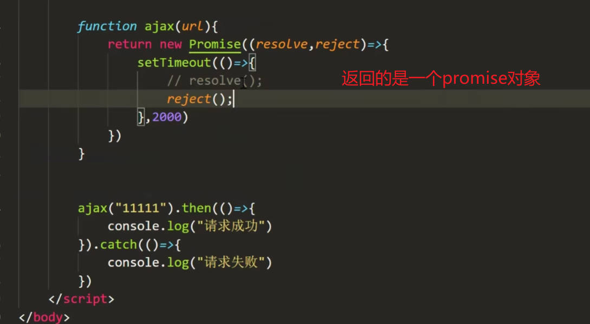
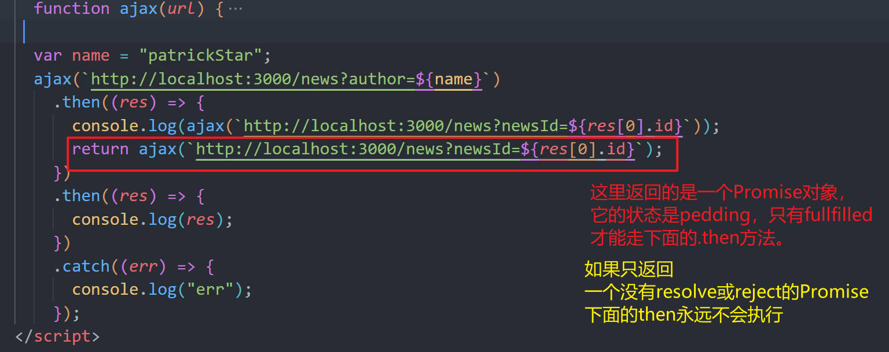
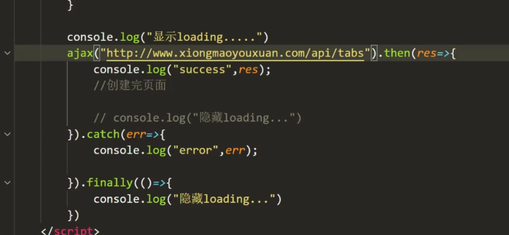

[TOC]

# ECMAScript

## let 声明变量

1. let 不会污染全局变量，生命周期仅在代码块中

```
if(true){
    var i = 0;
}
console.log(i); //可以打印出结果

if(true){
    let i = 0;
}
console.log(i);//不可以打印出结果

```

- 经典案例
  for 循环中 var 定义 i，绑定点击事件，打印结果都为圈数
  只需将 var 改为 let 则不会产生异常

2. 不允许重复声明

3. 没有了变量提升
   

4. 全局中用 var 定义的变量，会挂到 window 身上，但是 let 定义的变量不会挂到 window 对象身上

## const 关键字

- 特性：

1. 常量不能被改变，且必须初始化

2. 不能重复定义
   遵循块级思想，只在代码块内生效

3. 声明不提升

4. 不与顶层对象 window 挂钩

- const 定义的变量一定不能被修改吗？

```

const obj = {
    name: "zpc",
    age: 18
}

// obj = "obj1"   这个无法更改
对象是复杂数据类型，obj保存的是地址，所以地址内的变量可以更改

obj.name = "patrick";
log(name) //patrick

```

- 如果不想 const 对象被更改可以使用 freeze 属性


注：只能冻住一级属性，如果里面嵌套对象的话则内部对象的属性仍可以更改

## 解构赋值

### 数组的结构赋值

1. 简单的数组解构赋值
   > let arr = [1,2,3];
   > let [a,b,c] = arr;
   > console.log(a); // 1, log(b); //2 log(c); //3
2. 只拿第三个值

   > let arr = [1,2,3];
   > let [,,c] = arr; //需要把位置空出来

3. 默认赋值
   如果数组为空，设置了默认值后会取默认值。

> let [x=1] = [100];
> log(x); //100

### 对象的结构赋值

1.  简单的对象结构赋值

```
    let obj = {
        name: "zpc",
        age: 18
    }
    let {name,age} = obj;
    log(name); // zpc

    只填一个值也可以
    let {age} = obj;
    log(age); // 18
```

2. 解构时可能出现重名情况，会报错

```

let code = "1111";
let res = {
    code: "222",
    data: "amazing"
}
let {data,code} = res;

此时外部定义了code，又解构了code发生了重名！会报错！

此时的解决方案是，解构时重命名
let {data,code:co} = res;
log(co); // 222

```

3. 解构时初始化变量

```
let res = {
    code: "222",
    data: "amazing"
}
let {data,code,err="error"} = res; //这里error就是初始值

```

4. 数组，对象嵌套时的解构
   

5. 函数参数的解构赋值
   

6. 取字符串的值或长度
   

## 模板字符串

1. 语法：
   书写方式：\``，``内可以使用变量 ${}

2. ${}内可写表达式，用于逻辑处理
   **也可以写函数表达式**
   

### 字符串与数值的扩展应用

1. 字符串扩展

- includes 函数

判断字符串中是否存在指定字符

```

let myName = "patrick";

console.log(myName.includes("k")); //true 判断是否含有指定字符

console.log(myName.includes("k", 2)); 表示从第二个索引开始查看包不包含字符串

console.log(myName.startsWith("pa")) //true 判断是否以pa开头的字符串

console.log(myName.endsWith("ck")) //true 判断是否以ck结尾的字符串

console.log(myName.endsWith("r", 3)) //true 从末尾第三位数开始判断，判断是否以r结尾

```

2. 数值的扩展

- 进制的写法

```

let num1 = 100; // 十进制
let num2 = 0x100; // 十六进制
let num3 = 0b100; // 二进制
let num4 = 0o100; // 八进制

```

- Number.isFinite Number.isNaN
  isFinite 是否为有限数值
  区别：和 window 下的方法略有所不同，将全局的方法放入到了对象中，能更好的模块化
  

- isInterger 方法
  用来判断一个数值是否为整数。
  

- 极小常量 Number.EPSILON
  表示 1 与大于 1 的最小浮点数之间的差。 2.220446049250313e-16
  

// 由于计算机计算原因，如 0.1+0.2 并不等于 0.3，而是等于 0.3000000000000000004，会存在误差，所以用极小常量来判断

```

通过两个数相减，来比较是否小于极小常量 EPSILON

   function isEqual(x,y){
      return Math.abs(x-y) < Number.EPSILON
   }
   console.log(0.1+0.2, 0.3) //true
   console.log(2,3) //false
```

- Math.trunc

将小数部分抹掉，返回一个整数，与 Math.ceil 和 Math.floor 有所区别


- Math.sign
  用来判断一个数到底是正数、负数、还是零。对于非数值，会先将其转换为数值。
  

## 数组的扩展

### 扩展运算符


```

   let arr1 = [1,2,3]
   let arr2 = [4,5,6]
   console.log([...arr1, ...arr2]) //[1,2,3,4,5,6]

```


// ...只能放在以后一个解构赋值的元素身上

### 剩余运算符


### Array.from

可以把类数组，转化为真正的数组，然后就可以使用数组身上的方法

类数组身上没有 map, filter 方法

```

function test() {
   console.log(Array.from(arguments)) //这里将类数组转化为了真正的数组
}

test(1,2,3);

```


### Array.of

重新生成一个数组

和 Array 创建数组的区别

```

let arr1 = Array(3); //这会创建一个长度为3的空数组

let arr2 = Array.of(3); // [3]

```

### find findIndex()

- find, findIndex 用于条件查询

```
查找数组内第一个大于13的项
let arr = [11,12,13,14,15];

let res = arr.find(function(item){
   return item > 13;
})

log(res); //14

查找数组内第一个大于13的项的索引Index
let res = arr.findIndex(function(item){
   return item > 13;
})

log(res); //3
```

- findLast findLastIndex()
  从后面开始查找

- fill
  填充，用于初始化数组

```

let arr = new Array(3).fill("ac"); //创建了一个长度为3的空数组，并将值填充为ac

let arr = ["111", 22, 33];
console.log(arr.fill("patrick", 2, 3)); //arr将被填充为["patrick", 2, 3];

```

### flat() flatMap()

数组扁平化处理

```
let arr = [1,2,3,[4,5,6]]; //破除里面数组括号，扁平化处理

let arr1 = arr.flat(); //flat方法不影响原数组
log(arr); //[1,2,3,4,5,6]

例：将数组里每个元素拿出来，放入一维数组中
let arr = [
   ["安庆","鞍山","安阳"],
   ["北京","宝山","包头"]
]
console.log(arr.flat()); //['安庆', '鞍山', '安阳', '北京', '宝山', '包头']

```

```

let arr = [
   {
      name: "A",
      list:["安庆","鞍山","安阳"]
   },
   {
      name: "B",
      list:["北京","宝山","包头"]
   }

]

复杂数据类型实现扁平化(指定数据里面的某个属性进行扁平化处理)

let res = arr.flatMap(function(item){
   return item.list
})
log(res); //["安庆","鞍山","安阳","北京","宝山","包头"]

```

## 对象的扩展

### 对象简写

```

1. 字面量的普通写法

let obj = {
   name: "patrick",
   test: function(){

   },
   test1: function(){

   }
}

2.简写

let name = "moduleA"; 定义了一个name的变量
let obj = {
   name: "patrick", //如果key 和value是一样的命名，则可以只写一个
   name:name ==> name name变量和属性名都一样，则写一个
   test(){

   },
   test1(){

   }
}

```

2. 对象属性 表达式

```
let name = "a";

let obj = {
   [name]: "patrick" //加了[]，则将name变成了一个变量
}
console.log(obj);  // {a:"patrick"}

```

3. 扩展运算符 ... ES9 才有的

```
let obj = {
   name: "patrick"
}

let obj1 = {
   ...obj
}

log(obj1); // {name: "patrick"}

合并两个对象

let obj1 = {
   name: "patrick"
}

let obj2 = {
   age: 18
}

log({...obj1, ...obj2}) //{name: "patrick", age: 18}
// 如果属性重名，则后面的属性会覆盖前面的属性

```

4. Object.assign Es6 的合并对象方法
   合并对象

```
   let obj = {}

   let obj1 = {
      name: "kerwin"
   }

   let obj2 = {
      age: 18
   }

   let obj3 = {
      name: "tiechui"
   }

   console.log(Object.assign(obj1,obj2,obj3))
// 结果会影响obj1的结果(将obj2,obj3上的内容传到obj1上)，解决办法，添加一个空的obj在最前面
obj1会变为
```


---

解决办法


5. Object.is
   判断两个值是否相等, 与===几乎一致

// ==
// === 既判断类型，又判断值

无法判断 NaN，用 Object.is 可以判断 NaN


## 函数的扩展

1. 参数的默认值
   

2. rest 参数 剩余参数
   

3. name 属性 函数的名字

### 箭头函数

1. 简洁写法
   当只有一行代码的时候，return 可以省略
   

2. 如果返回结果是对象
   用小括号包起来
   

3. 如果形参只有一个参数，可以省略小括号

4. 无法访问 arguments，无法通过构造函数 new

   

5. 箭头函数没有 this，//this 指向副作用域

案例：获取输入框的值并发送请求模糊搜索（普通函数下的 this 指向 window）


改成箭头函数

**如果把外层那个 osearch 身上的函数也改成箭头函数，那么 this 就指向了 window 了**

## Symbol 数据类型

当对象中有属性时，从外部添加同名属性，会将对象内的属性覆盖掉。Symbol 就是为了保护其不会覆盖

> let s1 = Symbol(); //生成了一个 symbol 类型的数据
> 

- 注意事项

1. symbol 数据类型不能进行运算

2. 显示调用 toString()

3. 隐式的转换 Boolean

- 基础使用

  想添加一个属性到 obj 中，但是 obj 里已有重名的属性，则用 symbol 来添加
  

- 访问添加的 symbol 类型的属性

  

- 使用 symbol 的好处

  适用于封装库的开发

  

- symbol 传参

  方便在控制台知道属性
  

**for in 只能打印普通属性，无法遍历 symbol 属性**

如果想访问 symbol 属性，使用 Object.getOwnPropertySymbols() //里面传对象(只能遍历出 Symbols 的属性) 结果为一个数组

**既能遍历普通属性也能遍历 Symbol 属性的方法**
Reflect.ownKeys() //结果为一个数组


- Symbol 的第二个用途，作为唯一常量

  

## Iterator 迭代器

Iterator 的作用：

1. 为各种数据结构，提供一个统一的、简便的访问接口；
2. 使得数据结构的成员能够按某种次序排列
3. ES6 创造了一种新的遍历命令 for…of 循环，Iterator 接口主要供 for…of 循环

- Iterator 是内置方法

不能用 arr[Symbol(Symbol.Iterator)]这样的形式访问，Symbol()会生成一个新的 Symbol 类型的属性。

使用 arr[Symbol.Iterator]来使用迭代器

- 迭代器的遍历流程

  
  

- 原生具备 Iterator 接口的数据结构：
  

- 对象上迭代器的添加使用
  由于对象是非线性的，所以官方没添加迭代器进去
  如果对象的某个属性有数组，可以添加迭代器，并使用。
  
  

- 自我实现一个迭代器
  

- ...解构赋值和数组展开

... 会默认调用迭代器，任何部署了迭代器的数据结构，使用...都会转成数组结构

## Set 数据结构

它类似于数组，但成员的值都是唯一的，没有重复的值。返回值为一个对象

- 初识 Set

1. Set 初始化的第一种方式
   

2. 第二种方式

```
   let s2 = new Set();
   s2.add(1)
   s2.add(2)
   s2.add(2)
   s2.add(3)
   log(s2) // {1,2,3}

```

### set 实例属性和方法

```
   let s1 = new Set([1,2,2,3,3,4])

   s1.size //4       size方法

   s1.add(4).add(5) // s1=> {1,2,3,4,5}   add方法

   s1.has(8)  // false  has方法

   s1.delete(4) // {1,2,3}

   s1.clear() // {size: 0}
```


1. size 方法

set 数据结构的 .size 属性，返回 set 结构的长度

2. add 方法
   可连续调用添加

3. has
   可以判断 Set 结构中有没有某个值

4. delete

5. clear
   清空 Set 数据结构

### 遍历

1. Set.keys()
   返回键名的遍历器

2. Set.values()
   返回键值的遍历器

3. Set.entries()
   返回键值对的遍历器

4. Set.forEach()
   遍历每个成员
   

// 使用 Set.entries 对数组进行遍历，可以拿到索引和值

```
let arr = ["aa","bb","cc"];

for(let i of arr.entries()){
   console.log(i); //[0, "aa"] [1, "bb"], [2, "cc"]
}

可以通过解构赋值拿到索引和值

for(let [index,item] of arr.entries()){
   log(index,item)
}

-----------------------------------------

let s2 = new Set();
s2.add("11").add("22").add("33");

forEach方法

s2.forEach((index,item) => {
   console.log(item,index)
})

去重案例：

   let list = [1,2,2,"kerwin","kerwin",[1,2],[3,4],[1,2],{name: "kerwin"},{age:100},{name:"kerwin"}]

思路：通过Json.Stringfy转换为字符串的方式，并用数组的filter true和false结合set的has方法来实现

要点：filter 中true就返回该数据fasle则不返回该数据
通过字符串化以后，利用set的has方法，用filter进行比较

```

## Map 数据结构

类似于对象，也是键值对的集合，但是“键”的范围不限于字符串，各种类型的值(包括对象)都可以当作键。


```
let m1 = new Map([
   ["name","kerwin"],
   ["age",100],
   [{a:1},"大连"] // 这里的{a:1}，Map并不是把对象设置成键，而是把对象所在的地址设置成键。如果要访问的话，可以在外部设置一个变量存储地址
   如let adress = {a:1}, 然后把Map结构里面的键换成adress
])
console.log(m1);
```

结果如下


有四种方法：

1. size
2. add
3. has
4. delete
5. clear

四种遍历:

1. keys()
   拿到的是键

2. values()
   拿到的是值

3. entries()
   拿到的是键值对
   
4. forEach

## Proxy

没有 Proxy 之前用的方法

```

Object.defineProperty(obj,"data",{
   get(){
      //访问obj属性，get方法调用
   }
   set(){
      //修改属性，set方法调用
   }
 })
 // 往 obj 身上加了一个 data 属性

```


- proxy get 方法
  

- set 方法
  

- set 数据结构设置 proxy
  set 数据结构的话，proxy 能拦截到，但是访问不到 set 的方法，因为 proxy 中的 this 指向没更改为 set


## Reflect

Reflect 类似 Object

1. 代替 Object 某些方法
   

2. 修改某些 Object 方法返回结果
   

3. 命名式语法变成了函数式语法
   让 js 看起来更正经一些
   

4. 配合 proxy
   
   

   直接走数据结构的默认行为，不需要再使用 target[key] = value 的形式了
   

- 例子：数组的拦截
  

## Promise

是异步编程的一种解决方案，比传统的解决方案回调函数，更合理和更强大
特点：

1. 指定回调函数方式更灵活易懂
2. 解决异步回调地狱的问题

- 基础用法
  

1. promise 的 then 方法接受两个参数，一个是成功的回调函数，一个是失败的回调函数

2. promise 的 catch 方法，只有一个参数，且是回调函数，仅用于处理失败的结果

```

mypro.catch(()=>{
   console.log("dealing failed");
})

```

3. promise 的连写，then 中只传成功的回调，错误的回调交给 catch
   

4. 封装 ajax, 返回 promise 对象
   

- Promise 的三种状态
  
  

1. pending
2. fulfilled
3. rejected

**这三种状态的变化途径只有两种**

1. 从"未完成"到"成功"
2. 从"未完成"到"失败"

promise 的状态会被凝固住，只要成功或者则不再往下走了

```

let pro = new Promise((resolve,reject)=>{
   resolve();  //走完resolve 状态就会凝固为fullfilled，不会再走下面的reject()
   reject();
})


```

- promise 的结果
  resolve 可以接收一个参数, then 方法可以接收返回结果并处理
  

- 实现 ajax 的封装
  

### Promise 对象方法


- Promise.resolve
  将现有对象转为 Promise 对象
  // 1. 转换成 promise 对象

  > var p = Promise.resolve({name:"kerwin"});

  // 2. 参数也可以是一个 promise 对象


**将数据缓存到函数上，并通过 Promise.resolve 方法将缓存的数据转为 Promise 对象**


- Promise.reject
  Promise.reject(reason)方法返回一个新的 Promise 实例，该实例的状态为 reject
  

用法：返回错误的一个 Promise，让后面的 catch 进行处理


### Promise 链式调用

为什么能链式调用，是因为返回了一个新的 Promise 对象，状态变为 fullfilled 就可以被下面的 then 调用


调用完 then，实际上返回的是一个 Promise 对象


如果 then 方法里没有返回值，则默认返回 return undefined, fullfilled


- .then 方法的连续调用，下一个 then 的参数是上一个 then 返回的结果
  

- 关于返回一个新的 Promise 的 pedding 的案例
  
  // 上述案例是 先取一个 id，将 id 作为 newsid 的值去查询 contents 内容

### Promise.all

Promise.all()方法是将多个 Promise 实例，包装成一个新的 Promise 实例

只有 all()里面的所有 Promise 的状态都变为 fullfilled，Promise.all 的状态才会变为 fullfilled

### Promise.race

谁先改变状态,Promise.race 就跟着改变状态


- 请求延时的应用
  

### Promise.allSettled

**对 Promise.all 方法的补充**
不管一组中的 Promise 成功或失败，都会走 then 方法


- allSettled 的应用
  例如查询几个用户，当其中一个用户不存在的时候，用 all 方法的，就会直接走 catch，而不是走 then。只要使用了 allSettled 方法，不管成功或失败，都会走 then 方法
  
  

### Promise.any

只要参数实例有一个变成 fulfilled 状态，包装实例就会变成 fulfilled 状态；只有所有参数实例变成 rejected 状态，包装实例就会变成 rejected 状态。


### finally 方法

用途：使用场景，请求接口时显示转圈圈，请求完毕隐藏圈圈，捕捉到错误的时候也隐藏，这时就需要在 then 中写隐藏，catch 中也要写隐藏。如果用了 finally，走完 then 或 catch 都会执行隐藏操作


- finally 有透明的特性
  .finally 返回一个新的 Promise 对象，不管上面是返回的 Promise 状态是 fulfilled 还是 reject，finally 下面的 then 还是会执行
  

## async 与 await 语法


async 返回值是一个 promise 对象


- 使用 try catch 捕获错误
  

## Generator 函数


yield 后面可以跟值


yield 传递值，函数内部的变化


- yield ajax 的应用
  

## Class 语法

基本使用


## Class 继承

继承的话，使用 Super()方法继承父类


Class 继承，可以继承父类的 static 静态属性

## ES6-Module 语法

// 异步加载
// 私密不漏
// 重名不怕
// 依赖不乱

- 两种 module 导入方式比较
  

- export 可以导出一个对象，import 后面接的名字可以自定义
  

- 导入导出多个
  

- 不同 js 中需要引入才能使用
  

- 导入的两种风格
  导出时两种写法还可以混合使用
  

1. 加 default 的导出

```
导出：
export default {
   A1,
   A2
}
导入：
import name form "./xx.js"
通过.的方式访问
name.A1,
name.A2

```

2. 不加 default

不加 default 的这种导出方法等价于直接在方法前面加 export


```

   export {
      A1,
      A2
   }

   import {A1,A2} from "xxx.js"

```

3. 直接在前面加 export
   

4. 混合使用
   

- 解决重名
  

还可以使用全部导入并重命名的方式
**如果导入的文件中既有 export 写法和 default 写法，使用\*的方式会导出所有的属性和方法，放入一个对象中**


## NodeJS 中的模块化

NodeJS 中采用的是 commonjs 的语法规范


- NodeJS 中的导入规范

1. const name = require("xx.js")
   

   导出多个的时候，导入的结果为对象
   

- NodeJS 中的导出规范

1. module.exports = [name]
   
   
   需要导出多个，则用对象的方式
   

2. 挂载到对象身上的方式导出
   

- ES6 规范在 nodeJS 中的使用
  在 package.json 中配置成 module 模块化语法
  

## ES7 新特性

1. 求幂运算符

   > Math.pow(3,2) === 3 \*\* 2 //9

2. 数组中的 includes 方法
   > [1,2, NaN].includes(NaN) // true
   > [1,2, NaN].indexof(NaN) // -1 返回的是索引的位置 返回结果大于等于 0 则包含，小于 0 则不包含

## ES8 对象方法拓展

1. Object.values
   

2. Object.entries
   将对象转换为数组
   

3. Object.getOwnPropertyDescriptors()
   用于克隆对象，完整克隆对象身上的方法,get set 拦截等
   

## 字符串填充


## ES9 新特性

1. 对象的剩余参数与扩展运算符
   1-1. 对象的剩余参数
   

合并两个对象


应用场景：当别人调入函数没传参时，或参数不全，可以在函数内定义默认的参数对象，然后用扩展运算符变成一个完整的参数


## 正则扩展


## 异步遍历器

异步遍历器用于解决任务调度，使用场景，例如五个任务需要依次执行

1. 第一版雏形解决方案
   

2. 第二版用异步遍历器 async gen()的方式

异步生成器 gen 的返回值是 promise 对象


3. 第三版优化版
   

## ES10 新特性

1. Object.fromEntries
   轻松的将键值对列表转换为对象
   

用处：

用处 1:可以将 Map 数据结构转换为对象

用处 2:将处理 URL 地址的方法 URLSearchParams 转换为对象


用处 3: 在多维数组中统计城市的个数


思路：
第一步，现将对象变成数组
第二步，遍历数组，并解构，返回 key 和 value 的 length
第三步，将上一步结果通过 Object,fromEntries 转为一个对象

2. trimStart() and trimEnd()方法
   

去掉首尾空格


3. Symbol 对象的 description 属性
   

4. 可选的 catch
   

## ES11 Module 新增

1. 动态导入
   可以用于管理权限分层，实现根据不同权限导入不同的文件
   
   

2. import-meta
   返回一个对象，有一个 url 属性，返回当前模块的 url 路径，只能在模块内部使用

3. export \* as obj from 'module'
   
   把所有导出的东西，都放入一个对象中
   也可以用于当需要使用别人模块时，又不想复制一遍，可以使用这样的方式引入别人的模块，并新增自己的模块
   

```

    export * as obj from 'module'
    从另一个模块中，导出所有方法并命名为obj

    export function mytest(){} //再导出自己的方法

   export default {
      name: "mymodule"
   }
```

- 完整使用流程
  

## 字符串的 matchAll 方法


