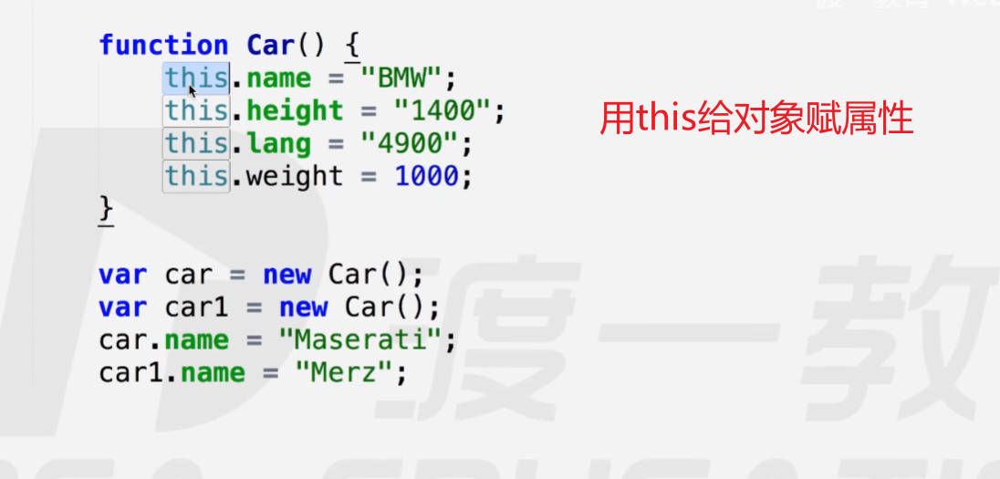
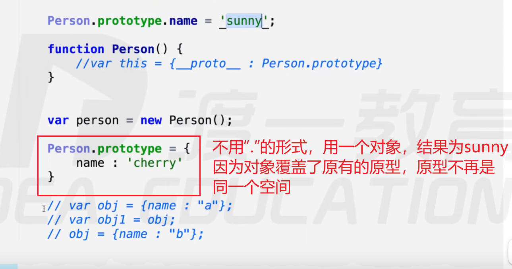
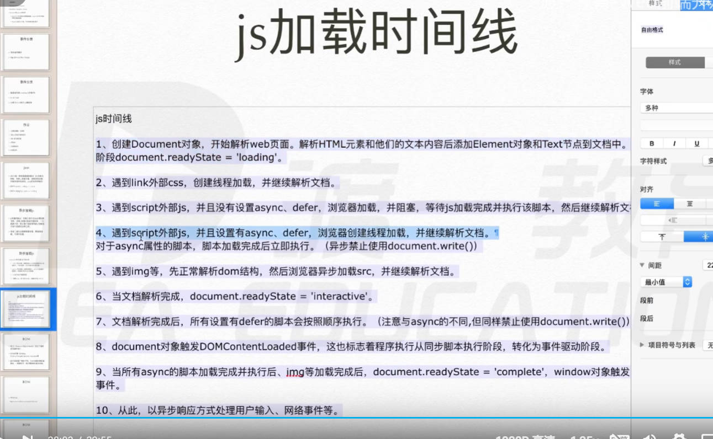
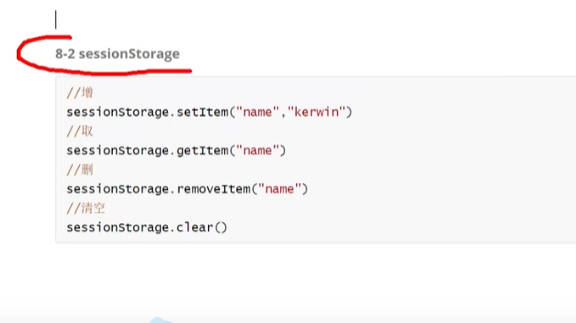
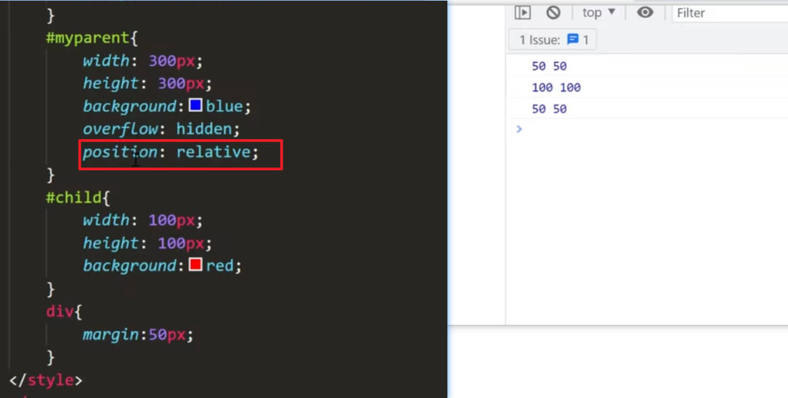
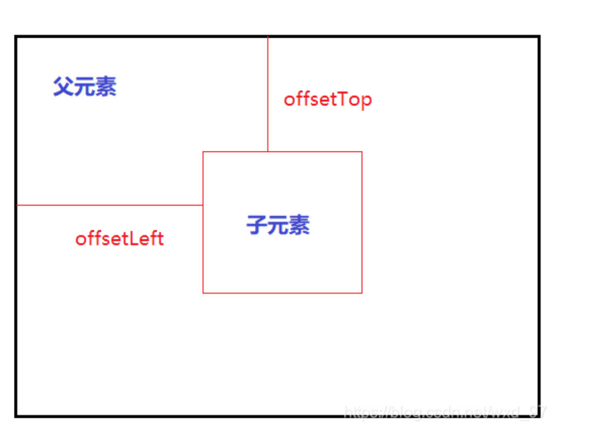
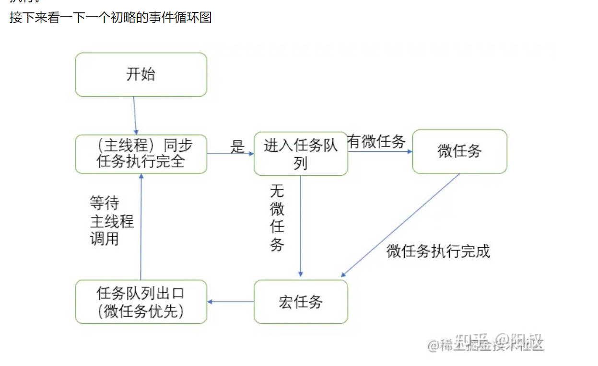

[toc]

# 值的类型

## 原始值

原始值存在栈：先进后出
number string undefined null boolean bigint symbol

# 函数

arguments 实参列表

```
function sum(a) {

}
sum(1,2,3)
实参传递123，形参虽然只有一个但是其他值传入了arguments中

function sum(a, b) {
    a= 2; a改变，arguments里面的a也改变
    arguments[0] = 3; 改变arguments里面的值，形参a也跟着变化了
    console.log(a);
    这是由于映射关系，不是引用地址，这两者不是一个变量
}
sum(1)

// 当形参有2个，实参只传递一个的时候，在函数内部给第二个形参赋值，打印arguments时，第二个参数为undefined
```

# 递归

```

function mul(n){
    if(n == 1){
        return;
    }
    return n*mul(n-1);
}
mul(5);

mul(5) ==> 5 * mul(4)
mul(4) ==> 4 * mul(3)
...

```

递归需要注意两点：

1. 找规律 (递归就是 return 规律)
2. 找出口 (已知条件当出口)

# 预编译


1. imply global

例如 a = 10;未声明直接赋值不报错，系统将其提升到暗示全局变量里
也就是放到了 window.a 里面了

申明了 var b = 10; b 也在 window 属性里面


- window 就是全局

## 预编译发生在函数执行的前一刻

**预编译过程：**

1. 创建 AO Activation Object(执行期上下文)
   

2. 找形参和变量声明，将变量和形参名作为 AO 属性名，值为 undefined
   
3. 将实参值与形参统一
   
4. 在函数体里面找函数声明，值赋予函数体
   

例子：

```

function test(a,b){
    console.log(a);
    c = 0;
    var c;
    a = 3;
    b = 2;
    console.log(b);
    function b () {}
    function d () {}
    console.log(b);
}

test(1);

输出结果：
1
2
2

```

**tips: 预编译还发生在全局**
全局第一步 生成 GO 对象


GO 生成时间先于 AO

```
1.生成GO
GO{
    global: undefined
    fn: fn () {}
}

var global = 100;

function fn() {
    console.log(global);
}
AO{

}
fn();

```

```
GO{
    global: 100,
    fn: undefined
}
-------------------------------
global = 100;
function fn() {
    console.log(global); //undefined
    global = 200;
    console.log(global); // 200
    var global = 300;
}
------------------------
AO{
    global: 200,
}
------------------------
fn();
var global;

```

go{
a: undefined
}

go {
bar: undefined
}

ao{
foo: function foo () {},
}

例题：

```

生成GO{
    bar: fnc
}

1.
    function bar() {
        return foo;
        foo = 10;
        function foo() {

    }
    var foo = 11;
}
    console.log(bar());

生成AO{
    foo: function foo() {},
}

2.
    console.log(bar());
    function bar() {
        foo = 10;
        function foo() {

        }
        var foo = 11;
        return foo;
    }


```

# 作用域

一个函数执行的时候会产生一个执行期上下文，即 AO，**函数每次执行时对应的执行期上下文都是独一无二的**。多次调用则产生多个 AO，当函数执行完毕时，产生的执行期上下文被销毁。


**scope chain 里存的是函数 a 作用域里的第零位，指向 global object**

**在哪个函数里面查找变量 就去哪个函数里的作用域链的顶端向下查找**

# 闭包

通俗来讲：内部的函数被保存到了外部，一定生成闭包！！


# 立即执行函数

即为初始化功能的函数

这样写的好处可以节省内存，适用于只需要调用一次的函数，调用完即销毁！

立即执行函数推荐写法
(function(){}()) w3c 标准

函数表达式能被执行符号即()执行（理论上只要是表达式都可以用()执行，并视为立即执行函数）：

```
函数表达式写法：
var test = function() {

}() 这里跟表达式可以被执行

函数声明写法：
function test(){}() 这里执行就会报错
```

# 避免闭包共用一个值的方案


# 对象 Object


对象里面放 this,this 就是指代的这个 Obj 对象

- 对象属性的删除方法：
  借助 delete 操作符
  

## 对象的创建方法

1. var obj = {} //plainObject 对象字面量/对象直接量

2. 构造函数创建方法

- 系统自带的构造函数 new Object() 、Array()、Number()

var obj = new Object();
这个 Object()是系统自带的构造函数，通过 new 加上系统自带的构造函数执行的方式，能产生一个对象

- 自定义


**写自定义构造函数时要遵循大驼峰式规则**



## 构造函数内部原理


有三个步骤:

```
function Student(name, age, sex) {
    //第一步 var this = {};

    //第二步执行this.xxx = xxx;
    //即AO = { this : {name: 'zhangsan'} }

    this.name = name;
    this.age = age;
    this.sex = sex;
    this.grade = 2017;
    // 第三步，隐式返回this对象 return this;
}

var student = new Student('zhangsan', 18, 'male')
```

## 包装类

**原始值不能有方法和属性**

```
//但是有个神奇的现象

    var str = "abc";
    str.length //可以输出结果，问题是原始值不能有方法和属性
    为什么能输出结果呢，因为会隐式的new String()，new完之后delete

    console.log(num.len) //再次new一个对象然后把属性放进去，此时没有值，所以打印undefined

```

### \_\_proto\_\_(起到连接原型和自己的作用)


关于用 person.prototype.name = xxx 和 person.prototype = {}的区别



### call


用了.call 会让对象里面所有的 this 都变成 obj

this 不 new 的时候，默认指向的是 window

### apply

apply 只能传一个形参，而且为数组

与 call 的区别：

call 需要把实参按照形参的个数传进去
apply 需要传一个 arguments

`apply(list,[])`

# 继承发展史

1. 传统形式 ——> 原型链

   - 过多的继承了没用的属性

2. 借用构造函数

   - 不能继承借用构造函数的原型
   - 每次构造函数都要多走一个函数

3. 共享原型

   - 不能随便改动自己的原型
     

```
    抽象出一个方法，以便以后构造的函数，都能继承
    function inherit(Target, Origin) {
        Target.prototype = Origin.prototype;
    }

```

4. 圣杯模式

```

function Father() {

}

function Son() {

}

function F() {

}
var father = new Father();
var son = new Son();
// 添加个中间人，让他的原型充当Son的原型
F.prototype = Father.prototype;
Son.prototype = new F()


封装继承：

function inherit(Target, Origin) {
    function F(){};
    F.prototype = Origin.prototype;
    Target.prototype = new F();
    Target.prototype.constructor = Target;
    Target.prototype.uber = Origin.prototyp; //这一步是标识自己真正继承的原型是谁
}
Father.prototype.lastName = "Deng";
function Father(){

}
function Son(){

}

inherit(Son,Father);
var son = new Son();
var father = new Father();

```

## 命名空间

管理变量，防止污染全局，适用于模块化开发


### obj 写法

obj.name ---> 其实就是 obj['name']

```

var deng = {
    w1:{ name : "xiaoliu" },
    w2:{ name : "xiaozhou" },
    w3:{ name : "xiaowang" },
    sayW: function(num){
        return this['w' + num] //可以通过传递不同num，访问不同的属性
    }
}

```

## 对象的枚举

- for in
  循环对象的属性
  

  ```
    obj遍历属性的时候要注意，如果用obj.prop，系统会把prop当作字符串，也就是 obj['prop'], 需要改成obj[prop]

    var obj = {
        name: 'zpc',
        age: 18,
        sex: 'male'
    }

    for(var prop in obj) {
        console.log(obj.prop) //此时打印的结果为3个undefined,因为系统内部将obj.prop的prop看做了字符串
    }
  ```

- hasOwnProperty
  用于判断某个对象中是否有某个属性，返回值为布尔值

- in
  虽然可以判断一个属性是否存在于对象中，但是 in 也会查取对象原型中是否含有该属性

- instanceof
  用于检测构造函数的 prototype 属性是否出现在某个实例对象的原型链上

```
//A对象 是不是 B构造函数构造出来的
//
// 看A对象的原型链上 有没有B的原型
A instanceof B

```

对象的构造函数是 Obj
数组的构造函数是 Array

# this 指向问题

1. 函数预编译过程中 this ——> window
   
2. 全局作用域里 this ——>window

3. call/apply 可以改变函数运行时 this 指向

4. obj.func(); func()里面的 this 指向 obj

## 深拷贝

```
var obj = {
    name: "abc",
    age: 123,
    card: ['visa', 'master'],
    wife: {
        name: "bcd",
        son: {
            name: "aaa"
        }
    }
}

var obj1 = {}


function deepClone(origin, target) {
    var target = target || {};
    var toStr = Object.prototype.toString;
        arrStr = "[object Array]";
    for(var prop in origin){
        if(typeof(origin[prop] == 'object')){
            if(toStr.call(origin[prop]) == arrStr){
                target[prop] = [];
            }else{
                target[prop] = {};
            }
        deepClone(origin[prop],target[prop]);
        }
    }else{
        target[prop] = origin[prop];
    }

}

```

完整版：


## 数组常用的方法

- 改变原数组
  - push, pop, shift, unshift, reverse
  - splice
- 不改变原数组
  - concat, join ————> split, toString, slice

### push

在数组最后一位添加数据

实现 Push 方法：

```

    var arr = [];
    Array.prototype.push = function() {
        for(var i = 0; i < arguments.length; i++){
            this[this.length] = arguments[i];
        }
    }

```

### pop

调用 pop，则把数组最后一位剪切出来，并返回所删除的值

### unshift

在数组最前面增加值

unshift 还可以传递参数，并在数组中增加所传参数

### shift

在数组最前面减去值

### reverse

### splice

**arr.splice(从第几位开始, 截取多少的长度, 在切口处添加新的数据)**

---

var arr = [1,1,2,2,3,3]
arr.splice(1,2) //返回结果为截取的数据[1,2] ,原数组变为[1,2,3,3]

---

arr.splice(1,1,0,0,0) 返回结果 [1],原数组变为[1,0,0,0,2,2,3,3]

---

在 arr 中间添加数据:
var arr = [1,2,3,5]
arr.splice(3,0,4) // 打印结果为[1,2,3,4,5]

---

splice 从负数位截取


### sort

- 排序数组，且改变原数组

- sort 排序是按 ASCII 码来排序

```
var arr = [1,3,5,4,10] //排序结果为 1 10 3 4 5
```

- sort()里可以写一个匿名函数
  

**返回值为正数，后面的数放在前面**
**返回值为负数，前面的数放在前面**

### concat

连接两个数组，**不改变原数组**

### slice

**不改变原数组**

slice(从该位开始截取, 截取到该位)

```
slice填两个参数的情况
var arr = [1,2,3,4,5,6];
arr.slice(1,2) //返回结果 [2]

slice填一个参数的情况
var arr = [1,2,3,4,5,6];
arr.slice(1) // [2,3,4,5,6]
```

### join

```
var arr = [1,2,3,4,5,6];
arr.join("-") ——————> 返回一个拼接好的字符串"1-2-3-4-5-6"
arr.join("!") ——————> 返回一个拼接好的字符串"1!2!3!4!5!6"

join可以连接成字符串，如若要改变原样可以调用字符串的一个方法split()

```


# 类数组

1. 可以利用属性名模拟数组的特性
2. 可以动态的增长 length 属性
3. 如果强行让类数组调用 push 方法，则会根据 length 属性值的位置进行属性的扩充。


类数组需要注意的是：
属性要为索引(数字)属性，必须有 length 属性，最好加上 push 方法


类数组的好处

```

var obj = {
    "2" : "a",
    "3" : "b",
    "length" : 2,
    "push" : Array.prototype.push
}


obj.push("c");  // 2的值变为c
obj.push("d"); // 3的值变为d

push会发生如下隐式调用
Array.prototype.push(
    function(target){
        this[this.length] = target;
        this.length ++;
    }
)
//当obj调用时this指向obj

```

封装 type:

```

function type(target){
    // 1.分两类 原始值 引用值
    // 2.区分引用值

    var templete = {
        "[object Array]" : "array",
        "[object Object]" : "object",
        "[object Number]" : "number - object",
        "[object boolean]" : "boolean - object",
        "[object String]" : "string - object",
    }

    if (typeof(target == null)){
        return null;
    }else if(typeof(target) == 'object'){
        var str = Object.prototype.toString.call(target);
        return template[str];
    }else {
        return typeof(target);
    }
}

```

### 数组去重

```

var arr = [1,1,3,3,4]

Array.prototype.unique = function() {
    var temp = {},
        arr = [],
        len = this.length;
    for(var i = 0; i < len; i++){
        if(!temp[this[i]]) {
            temp[this[i]] = "abc";
            arr.push(this[i]);
        }
    }
}

```

# try...catch

```

   try{
       console.log('a');
       console.log(b);
       console.log('c');
   }catch(e){

   }
   console.log('d');
   try中代码如果有错误，则不会抛出error，然后不再执行try里面的代码，但会接着按顺序执行外边的代码


catch里面代码在 try执行抛出错误时，捕捉到错误
```

# DOM 初探


事件监听

```

div.onclick = function() {
    //监听点击事件
}

```

## DOM 元素选择


## 遍历节点树：


节点不止有 Html 元素还有属性，文本，注释等


## 遍历元素节点树


## 节点的四个属性


## DOM 结构树


# date 对象

```

var date = new date();

```

## setInterval 定时器

## clearInterval 清除定时器

让定时器消失

## setTimeout

定时器，推迟一段时间后执行（只执行一次）

## DOM 基本操作

### 滚动条


### 查看视口尺寸


### 查看元素的几何尺寸

结果不是实时的，没吊用


### 查看元素的位置


求的是视觉上的尺寸，如果盒子有 padding，也会包含 padding 在内！
如果求盒子内容尺寸，直接用 元素.style.width/height

- dom.offsetLeft 求的结果是**它的有定位的父级元素的距离**
  

### 让滚动条滚动


### 脚本化 CSS


- 查询计算样式
  

### 事件


### 解除事件


### 事件处理模型


### 取消冒泡


### 事件分类


### 套锁实现开关


### keydown 和 keypress 的区别

keydown 可以响应任何键盘按键，keypress 只能响应字符类键盘按键


### 文本类操作事件


## Json 数据格式


## 异步加载 js


## js 加载时间线



# 正则表达式

## 转义字符

- "\\"，表示转义字符
- "\\n"，表示换行
- "\\r"，表示行结束符
- "\\t"，表示缩进

## RegExp

正则表达式的作用：匹配特殊字符或有特殊搭配原则的字符 的最佳选择

- RegExp 两种写法

1. "//"双斜线里面书写规则
2. new RegExp()

- 修饰符
  i 忽略大小写
  g 匹配全局
  m 多行匹配(配合着查找开头结尾用)

/^ 表示查找以什么开头的

- reg.test(); 只能判断字符串是否有符合的片段，返回结果为 boolean
- str.match(); 能把匹配结果返回

### 表达式

1. [], 一个[]代表一位,里面可以填值或值的区间
   例如匹配三个连续的数字
   

2. [^value] 表示查找任何不在方括号之间的字符

3. (red|blue|green) |表示或 ()表示优先运算
   

### 元字符

1. \w, \w === [1-9A-z_]
2. \W, 大写表示只匹配小写 w 的区间外
3. \d 查找数字
4. \D 查找非数字
5. \s 查找空白字符(包含空格)
   
   - 换行符： \n
   - 换页符: \f
   - 回车符: \r
   - 制表符: \t
   - 垂直制表符: \v
6. \S 查找非空白字符
7. \b 匹配单词边界
8. \B 匹配非单词边界
9. \t 匹配真实代码写了\t 的字段，不匹配视觉上的 tab 制表符
10. \xxx 查找以八进制数 XXX 规定的字符
11. \xdd 查找以十六进制数 dd 规定的字符
12. \uxxxx 查找以十六进制数 xxxx 规定的 Unicode 字符
    这个\uxxxx 可以匹配汉字

13. "." 可以查找单个字符，除了换行和行结束符

### 量词

1. n+ {1,}
   表示这个变量可以出现 1 次到无数次
   

2. n\* {0,}
   匹配任何包含 0 个或多个 n 的字符串
   

3. n? {0,1} 取值为 0-1 个

4. n{X}
   n 个 n 个的匹配
5. n{x,y}
   n{3,5} 3-5 个匹配，优先原则：优先 5 个其次 4 个最后 3 个
6. n{X,}

7. n$
   匹配任何结尾为 n 的字符串

8. ^n
   匹配任何开头为 n 的字符串

9. ?=n
   匹配任何其后紧接指定字符串 n 的字符串
10. ?!n
    匹配任何其后没有紧接指定字符串 n 的字符串。


## 正则表达式的方法

1. test
   检索字符串中指定的值。返回 true 或 false。
2. exec
   检索字符串中指定的值。返回找到的值，并确定其位置。


3. 支持正则表达式的 String 对象的方法
   

## 贪婪匹配

在量词后加问号，表示非贪婪匹配


## reg.ever 方法

可以写多个正则来匹配判断

```

例如：验证密码必须含有一个数字，字母

var regs = [
    /^[a-z0-9]{5,10}$/i,
    /[A-Z]/,
    [0-9]
]

var state = regs.every(e => e.test(value));

// 用every方法可以使多个正则同时起作用去匹配

```

## reg.matchall 方法


# BOM 浏览器对象模型

BOM 的核心是 window 对象

## 浏览器可视窗口的尺寸

- innerHeight 和 innerWidth
  这两个方法分别是用来获取浏览器窗口的宽度和高度(包含滚动条的)

## 浏览器的地址信息

在 winodw 中有个对象叫 location,专门用于存储浏览器的地址栏内的信息

- location.href
  这个属性存储的是浏览器地址栏内 url 地址的信息
  

location.href 也可以用于跳转页面

- reload
  页面重新加载

## 浏览器的 onload 事件

在页面所有资源加载完毕后执行(图片、视频、dom)

## 浏览器的 resize 事件

window.resize
在移动端不同屏幕上面显示时，视图窗口大小不一。 window.resize 是窗口大小改变时触发的事件。

## window.onscroll

滚动条滚动时触发的事件

## 浏览器滚动距离

- document.documentElement.scrollTop 纵向滚动距离

  scrollTop 计算的是页面滚动到上面的距离
  

注意：如果 有 低版本浏览器不支持 !Doctype 声明的话，上述方法会失效，无法获取滚动条滚动的距离

解决：改用 document.body.scrollTop

- document.documentElement.scrollLeft 横向滚动距离

## window.scrollTo()

写法 1：接收两个参数，x 轴，y 轴

> windwo.scrollTo(0,0)

写法 2：对象

```

    window.scrollTo({
        left:0,
        top:0
        })

```

## window.open

在空白页面中打开新的内容

## window.close

关掉当前页面

## 浏览器的历史记录 history

window 中有一个对象叫做 history，专门用于存储历史记录信息的

1. history.back
   回退历史记录，回退到前一页
2. history.forward
   到下一个历史记录中去，前提是需要有过回退操作

3. history.go()

history.go(-1) 等价于 history.back(),回退一个页面
history.forward(2)，前进两个页面

## 浏览器本地存储

### localStroage

1. localStorage.setItem
   存储内容: **只能存字符串**
   

2. localStorage.getItem
   取出存储的内容

   > localStroage.getItem("name") //kerwin

3. localStorage.removeItem
   删除数据

   > localStorage.removeItem("name") // 删除了 name 属性的内容

4. localStorage.clear
   全部删除存储的数据
   > localStorage.clear()

### sessionStorage



**localStorage 和 sessionStorage 的区别：**

1. localStorage 是永久存储，sessionStorage 是绘画存储(临时存储)

sessionStorage，关闭页面就会丢失

# DOM 浏览器对象模型

## 获取元素尺寸


1. offsetWidth 和 offsetHeight

   offsetWidth 的计算：内容+padding+border

- 盒模型不会影响计算
  

- 注意：

  1). 单位是数字
  2). display:none 拿不到元素的宽度

2. clientWidth 和 clientHeight

   clientWidth 的计算：内容+padding

## 获取元素的偏移量

1. offsetLeft 和 offsetTop
   此时这个距离是距离最底部的距离，而不是距离父元素的距离
   

**offset 的参考点：是定位父级**
当给父元素加上定位时，此时 offset 值的变化


2. clientLeft 和 clientTop
   

## 获取可视窗口的尺寸

注意：window.innerHeight 和 window.innerWidth 获取的是**包含滚动条的可视距离**

此时如果只想计算可视区内容的尺寸，可以用 document.documentElement.clientWidth 和 document.documentElement.clientHeight

## 总结 JS 中各种尺寸的用途

1. clientWidth/clientHeight

   视口大小：可见区域的宽度或高度，不包括 border、水平滚动条、margin 的元素的宽度或高度，只包括元素的内容区域和 padding 值
   

2. offsetWidth/offsetHeight

视觉大小：看得见的大小，不包括 margin 的元素的宽度或高度，只包括 padding、border、水平滚动条的宽度或高度


3. offsetTop/offsetLeft

当前元素的偏移量：当父级有定位，根据父级的偏移量，父级没有定位则是根据页面的偏移量。表示相对父级顶部或者左边的距离。


4. scrollWidth/scrollHeight

当产生滚动条时，元素里边全文内容的宽度或高度，包含溢出的文本的尺寸，也就是包含可滚动的距离(scrollTop/scrollLeft)。

5. scrollTop/scrollLeft

滚动的距离到顶部或左边的位置。(可设置)


# Http————三次握手与四次挥手

## 三次握手

1. 第一次握手：建立连接时，客户端发送 syn 包（seq=x）到服务器，并进入 SYN_SENT 状态，等待服务器确认；SYN：同步序列编号（Synchronize Sequence Numbers）。**TCP 规定，SYN 报文段（SYN=1 的报文段）不能携带数据，但需要消耗掉一个序号。**

2. 第二次握手：服务器收到 syn 包，必须确认客户端的 SYN（ack=x+1），同时自己也发送一个 SYN 包（seq=y），即 SYN+ACK 包，此时服务器进入 SYN_RECV 状态。**这个报文也不能携带数据，但是同样要消耗一个序号。**

3. 第三次握手：客户端收到服务器的 SYN+ACK 包，向服务器发送确认包 ACK(ack=y+1)，此包发送完毕，客户端和服务器进入 ESTABLISHED（TCP 连接成功）状态，双方就可以通信了，完成三次握手。**TCP 规定，ACK 报文段可以携带数据，但是如果不携带数据则不消耗序号。**


通俗理解：

第一次握手：客户端要和服务端进行通信，首先要告知服务端一声，遂发出一个 SYN=1 的连接请求信号,”服务端，我想和你说话”。

第二次握手：当服务端接收到客户端的连接请求，此时要给客户端一个确认信息，”我知道了（ACK）,我这边已经准备好了，你现在能连吗（SYN）”。

第三次握手：当客户端收到了服务端的确认连接信息后，要礼貌的告知一下服务端，“好的，咱们开始联通吧（ACK）”。

## 四次挥手(TCP 连接的释放)

在断开连接之前客户端和服务器都处于 ESTABLISHED 状态，双方都可以主动断开连接，以客户端主动断开连接为优。

挥手过程：

1. 第一次挥手：客户端打算断开连接，向服务器发送 FIN 报文(FIN 标记位被设置为 1，1 表示为 FIN，0 表示不是)，FIN 报文中会指定一个序列号，之后客户端进入 FIN_WAIT_1 状态。

也就是客户端发出连接释放报文段(FIN 报文)，指定序列号 seq = u，主动关闭 TCP 连接，等待服务器的确认。

**TCP 规定，FIN 报文段即使不携带数据，也要消耗一个序号。**

2. 第二次挥手：服务器收到连接释放报文段(FIN 报文)后，就向客户端发送 ACK 应答报文，以客户端的 FIN 报文的序列号 seq+1 作为 ACK 应答报文段的确认序列号 ack = seq+1 = u + 1。

接着服务器进入 CLOSE_WAIT(等待关闭)状态，此时的 TCP 处于半关闭状态，客户端到服务器的连接释放。客户端收到来自服务器的 ACK 应答报文段后，进入 FIN_WAIT_2 状态。

3. 第三次挥手：服务器也打算断开连接，向客户端发送连接释放(FIN)报文段，之后服务器进入 LASK_ACK(最后确认)状态，等待客户端的确认。

服务器的连接释放(FIN)报文段的 FIN=1，ACK=1，序列号 seq=m，确认序列号 ack=u+1。

4.第四次挥手：客户端收到来自服务器的连接释放(FIN)报文段后，会向服务器发送一个 ACK 应答报文段，以连接释放(FIN)报文段的确认序号 ack 作为 ACK 应答报文段的序列号 seq，以连接释放(FIN)报文段的序列号 seq+1 作为确认序号 ack。

之后客户端进入 TIME_WAIT(时间等待)状态，服务器收到 ACK 应答报文段后，服务器就进入 CLOSE(关闭)状态，到此服务器的连接已经完成关闭。

通俗理解：

第一次挥手：双方交流的差不多了，此时客户端也已经结尾了，接下来要断开通信连接，所以告诉服务端“我说完了（FIN）”，此时自身形成等待结束连接的状态

第二次挥手：服务端知道客户端已经没话说了，服务端此时还有两句心里话要给客户端说，“我知道你说完了（ACK），我再给你说两句，吧啦吧啦。。。

第三次挥手：此时客户端洗耳恭听继续处于等待结束的状态，服务器端也说完了，自身此时处于等待关闭连接的状态，并对告诉客户端，“我说完了，咱们断了吧（FIN）”。

第四次挥手：客户端收知道服务端也说完了，也要告诉服务端一声（ACK），因为连接和断开要双方都按下关闭操作才能断开，客户端同时又为自己定义一个定时器，因为不知道刚才说的这句话能不能准确到达服务端（网络不稳定或者其他因素引起的网络原因），默认时间定为两个通信的最大时间之和，超出这个时间就默认服务器端已经接收到了自己的确认信息，此时客户端就关闭自身连接，服务器端一旦接收到客户端发来的确定通知就立刻关闭服务器端的连接。

# 事件循环 Event Loop

事件循环 Event Loop 又叫事件队列

## 微任务、宏任务

1. 微任务与宏任务就属于 js 代码的范畴
2. js 代码主要分为两大类： 同步代码、异步代码
3. 异步代码又分为：微任务与宏任务
   

## 事件循环 Event Loop 执行机制

1. 进入到 script 标签,就进入到了第一次事件循环
2. 遇到同步代码，立即执行
3. 遇到宏任务,放入到宏任务队列里
4. 遇到微任务,放入到微任务队列里
5. 执行完所有同步代码
6. 执行微任务代码
7. 微任务代码执行完毕，本次队列清空

寻找下一个宏任务，重复步骤 1
// 以此反复直到清空所以宏任务，这种不断重复的执行机制，就叫做事件循环



## 易错点

1. promise 本身是同步的,then 才是异步的

2. **await** 右边的表达式还是会立即执行,表达式之后的代码才是微任务, await 微任务可以转换成等价的 promise 微任务分析

3. script 标签本身是一个宏任务， 当页面出现多个 script 标签的时候，浏览器会把 script 标签作为宏任务来解析

## 练习

1. 当函数内有两个 await，只有第一个 await 右边的代码会被立即执行
   

2. promise 与 async 结合
   
   

# cookie

本地存储
