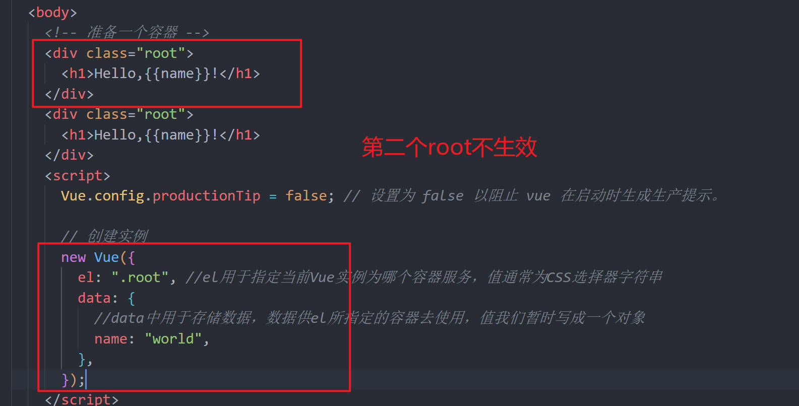
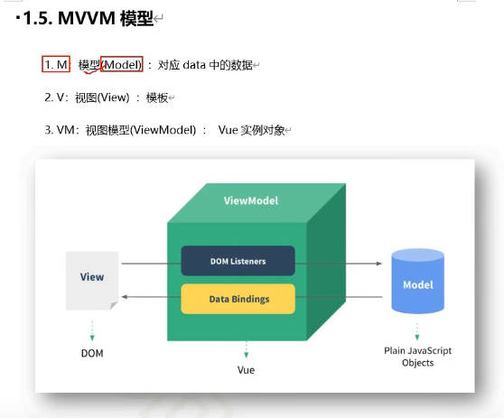
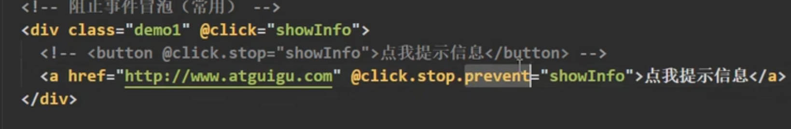
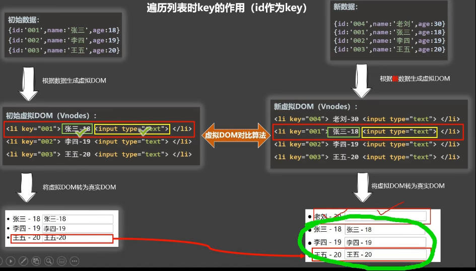
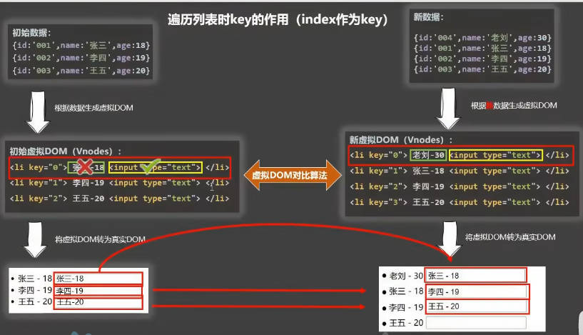
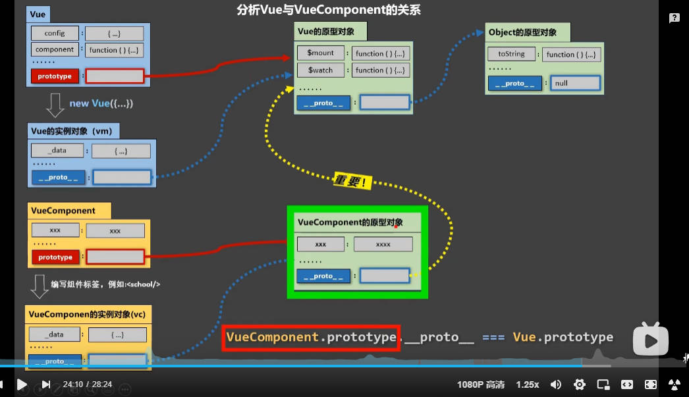
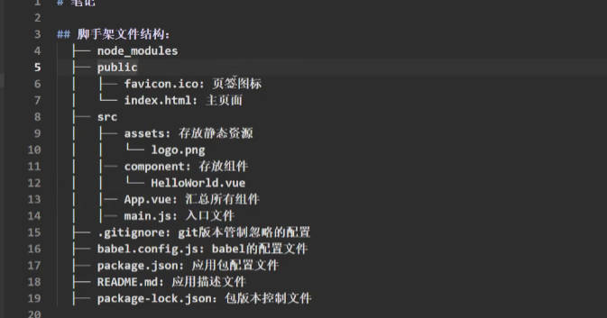

# Vue

## 容器和实例之间的关系

容器和实例之间是一一对应的关系

## MVVM 模型

## 事件注意事项

1. 事件可以连写
   如果想让 a 链接既不冒泡，也不执行默认事件，可以连写
   

## key 的作用与原理

动态绑定 key 的时候如果绑定的是 index 可能会造成效率问题，及其他的 bug

### key 的原理值虚拟 DOM 比较

1. index 作为 key 的弊端
   

第一步。将初始数据生成虚拟 DOM

第二步。将虚拟 DOM 转换为真实 DOM

第三步。将新数据生成虚拟 DOM

第四步。用 diff 算法拿着 key 对虚拟 dom 进行比较
比较时，**首先比较文本节点与上次的虚拟 dom 是否一致**，再比较 input 节点是否一致(注意，真实 dom 上虽然被用户写了信息，但是实际上 diff 比较的是内存中的 input 节点，所以认为 input 没有变化)

**当比较后发现不一致时，将新的虚拟 DOM 重新生成一个新的真实 DOM**，比较 input 时，发现两个虚拟 dom 中的 input 都一样，**则直接进行复用，不再重新生成新的真实 DOM 节点** （此时就导致了张三-18 残留在了老刘-40 的文本输入框里面）

2. id 作为 key
   

3. 如果没有写 key
   vue 默认将列表遍历的 index 作为 key

## VueComponent 的原型对象的隐式原型对象 是 Vue 的原型对象

## 脚手架文件结构：

## 关于不同版本的 Vue:

- vue.js 与 vue.runtime.xxx.js 的区别：
  (1).vue.js 是完整版的 Vue,包含：核心功能+模板解析器
  (2).vue.runtime.xxx.js 是运行班的 Vue,只包含：核心功能；没有模板解析器

- 因为 vue.runtime.xxx.js 没有模板解析器，所以不能使用 template 配置项，需要使用
  render 函数接收到的 createElement 函数去指定具体内容

## Vue 的入口文件更改

如果想要改 main.js 、index.html 或 public 文件夹名 可配置一个 vue.config.js 文件

使用 vue inspect > output.js 可以查看 Vue 脚手架的默认配置。

## ref 属性

1. 被用来给元素或子组件注册引用信息(id 的替代者)

2. 应用在 html 标签上获取的是真实 DOM 元素,应用在组件标签上是组件实例对象

3. 使用方式：
   打标识：<h1 ref="xxx">....</h1> 或 <School ref="xxx"></School>
   获取: this.$refs.xxx

## 配置项 props

功能：让组件接收外部传过来的数据

(1). 传递数据：
<Demo name="xxx">

(2). 接收数据：
   第一种方式(只接收):
      props: ["name"]

   第二种方式(限制类型)
      props:{
         name:Number
      }

第三种方式(限制类型、限制必要性、指定默认值)
   props:{
      name: {
      type: String, //name 的类型是字符串
      required: true, //name 是必要的
      default: '老王' //默认值
      },
   }
   备注：props是只读的，Vue底层会监测你对props的修改，如果进行了修改，就会发出警告

## mixin(混入)
   功能：可以把多个组件共用的配置提取成一个混入对象
   使用方式：
      第一步定义混合，例如:
         {
            data(){...},
            methods:{...},
            ...
         }
      第二步使用混入，例如：
         (1).全局混入：Vue.mixin(xxx)
         (2).局部混入：mixins:['xxx']

## Vue插件
   功能：用于增强Vue
   本质：包含install方法的一个对象，install的第一个参数是Vue，第二个以后的参数是插件使用者传递的数据。
   定义插件：
      对象.install = function(Vue,options){
         //1. 添加全局过滤器
         Vue.filter(...)

         //2. 添加全局指令
         Vue.directive(...)
      }

## scoped样式
   作用：让样式在局部生效，防止冲突。
   写法：<style scoped>