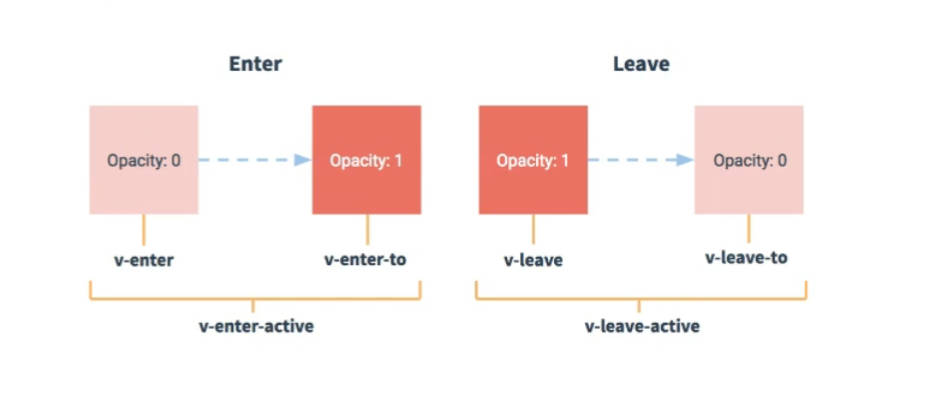

# Vue

## 容器和实例之间的关系

容器和实例之间是一一对应的关系


## MVVM 模型


## 事件注意事项

1. 事件可以连写
   如果想让 a 链接既不冒泡，也不执行默认事件，可以连写
   

## key 的作用与原理


动态绑定 key 的时候如果绑定的是 index 可能会造成效率问题，及其他的 bug

### key 的原理值虚拟 DOM 比较

1. index 作为 key 的弊端
   

第一步。将初始数据生成虚拟 DOM

第二步。将虚拟 DOM 转换为真实 DOM

第三步。将新数据生成虚拟 DOM

第四步。用 diff 算法拿着 key 对虚拟 dom 进行比较
比较时，**首先比较文本节点与上次的虚拟 dom 是否一致**，再比较 input 节点是否一致(注意，真实 dom 上虽然被用户写了信息，但是实际上 diff 比较的是内存中的 input 节点，所以认为 input 没有变化)

**当比较后发现不一致时，将新的虚拟 DOM 重新生成一个新的真实 DOM**，比较 input 时，发现两个虚拟 dom 中的 input 都一样，**则直接进行复用，不再重新生成新的真实 DOM 节点** （此时就导致了张三-18 残留在了老刘-40 的文本输入框里面）

2. id 作为 key
   

3. 如果没有写 key
   vue 默认将列表遍历的 index 作为 key

## VueComponent 的原型对象的隐式原型对象 是 Vue 的原型对象


## 脚手架文件结构：


## 关于不同版本的 Vue:

- vue.js 与 vue.runtime.xxx.js 的区别：
  (1).vue.js 是完整版的 Vue,包含：核心功能+模板解析器
  (2).vue.runtime.xxx.js 是运行班的 Vue,只包含：核心功能；没有模板解析器

- 因为 vue.runtime.xxx.js 没有模板解析器，所以不能使用 template 配置项，需要使用
  render 函数接收到的 createElement 函数去指定具体内容

## Vue 的入口文件更改

如果想要改 main.js 、index.html 或 public 文件夹名 可配置一个 vue.config.js 文件

使用 vue inspect > output.js 可以查看 Vue 脚手架的默认配置。

## ref 属性

1. 被用来给元素或子组件注册引用信息(id 的替代者)

2. 应用在 html 标签上获取的是真实 DOM 元素,应用在组件标签上是组件实例对象

3. 使用方式：
   打标识：<h1 ref="xxx">....</h1> 或 <School ref="xxx"></School>
   获取: this.$refs.xxx

## 配置项 props

功能：让组件接收外部传过来的数据

(1). 传递数据：
<Demo name="xxx">

(2). 接收数据：
   第一种方式(只接收):
      props: ["name"]

   第二种方式(限制类型)
      props:{
         name:Number
      }

第三种方式(限制类型、限制必要性、指定默认值)
   props:{
      name: {
      type: String, //name 的类型是字符串
      required: true, //name 是必要的
      default: '老王' //默认值
      },
   }
   备注：props是只读的，Vue底层会监测你对props的修改，如果进行了修改，就会发出警告

## mixin(混入)
   功能：可以把多个组件共用的配置提取成一个混入对象
   使用方式：
      第一步定义混合，例如:
         {
            data(){...},
            methods:{...},
            ...
         }
      第二步使用混入，例如：
         (1).全局混入：Vue.mixin(xxx)
         (2).局部混入：mixins:['xxx']

## Vue插件
   功能：用于增强Vue
   本质：包含install方法的一个对象，install的第一个参数是Vue，第二个以后的参数是插件使用者传递的数据。
   定义插件：
      对象.install = function(Vue,options){
         //1. 添加全局过滤器
         Vue.filter(...)

         //2. 添加全局指令
         Vue.directive(...)
      }

## scoped样式
   作用：让样式在局部生效，防止冲突。
   写法：```<style scoped>```

## 总结TodoList案例
1. 组件编码流程：
    (1).拆分静态组件：组件要按照功能点拆分，命名不要与html元素冲突。
    (2).实现动态组件，考虑好数据的存放位置，数据是一个组件在用，还是一些组件在用：
        1).一个组件在用：放在组件自身即可。
        2).一些组建在用：放在他们共同的父组件上(状态提升)。

2. props适用于：
    (1).父组件 ===> 子组件 通信
    (2).子组件 ===> 父组件 通信 (要求父先给子一个函数)

3. 使用v-model时要切记：v-model绑定的值不能是props传过来的值，因为props是不可以修改的！

4. props传过来的若是对象类型的值，修改对象中的属性时Vue不会报错，但不推荐这样做。

## 组件的自定义事件
1. 一种组件间通信的方式，适用于：子组件 ===> 父组件

2. 使用场景：A是父组件，B是子组件，B想给A传数据，那么就要在A中给B绑定自定义事件(<span style="color:red">事件的回调在A中</span>)

3. 绑定自定义事件：
    1. 第一种方式，在父组件中 ``` <Demo @atguigu="test"> 或 <Demo v-on:atiguigu="test"/> ```

    2. 第二种方式，在父组件中：

        ```js
            <Demo ref="demo"/>
            .....
            mounted(){
                this.$refs.xxx.$on('atguigu',this.test)
            }
        ```

    3. 若想让自定义事件只能触发一次，可以使用```once```修饰符，或```$once```方法。

    4. 触发自定义事件：``` this.$emit('atguigu',数据) ```

    5. 解绑自定义事件: ``` this.$off('atguigu') ```

    6. 组件上也可以绑定原生DOM事件，需要使用native修饰符

    7. 注意：通过``` this.$refs.xxx.$on('atguigu',回调) ```绑定自定义事件时，回调<span style="color:red">要么配置在methods中，要么用箭头函数</span>，否则this指向会出问题！

## 全局事件总线(GlobalEventBus)
1. 一种组件间通信的方式，适用于任意组件间通信。
2. 安装全局事件总线：
```
    new Vue({
        ...
        beforeCreate(){
            Vue.prototype.$bus = this //安装全局事件总线，$bus就是当前应用的vm
        }
    })

```
3. 使用事件总线：

    1. 接收数据：A组件想接收数据，则在A组件中给$bus绑定自定义事件，事件的回调留在A组件自身。
    ```
    methods(){
        demo(data){...}
    }
    ...
    mounted(){
        this.$bus.$on('xxx',this.demo)
    }
    ```
    2. 提供数据：```this.$bus.$emit('xxx',this.demo)```

4. 最好在beforeDestroy钩子中，用$off去解绑<span style="color:red">当前组件所用到的</span>事件

## 消息订阅与发布(pubsub)
1. 一种组件间通信的方式，适用于<span style="color:red">任意组件间通信。</span>

2. 使用步骤：

    1. 安装pubsub: ```npm i pubsub-js```

    2. 引入: import pubsub from "pubsub-js"

    3. 接收数据: A组件想接收数据，则在A组件中订阅消息，订阅的<span style="color:red">回调留在A组件自身。</span>
    ```
    methods(){
        demo(data){...}
    }
    ...
    mounted(){
        this.pid = pubsub.subsribe('xxx',this.demo) //订阅消息
    }

    ```
    4. 提供数据: pubsub.publish('xxx',data)

    5. 最好在beforeDestroy钩子中，用```pubsub.unsubscribe(pid)```去<span style="color:red">取消订阅。</span>

## nextTick
1. 语法：this.$nextTick(回调函数)

2. 作用：在下一次DOM更新结束后执行其指定的回调。

3. 什么时候用：当改变数据后，要基于更新后的新DOM进行某些操作时，要在nextTick所指定的回调函数中执行。

## Vue封装的过渡与动画
1. 作用：在插入、更新或移除DOM元素时，在合适的时候给元素添加样式类名
2. 图示：


3. 写法：
    1.准备好样式：
        - 元素进入的样式：
        &emsp;&emsp;1.v-enter: 进入的起点
        &emsp;&emsp;2.v-enter-active: 进入的过程中
        &emsp;&emsp;3.v-enter-to:进入的终点
        - 元素离开的样式：
        &emsp;&emsp;1.v-leave: 离开的起点
        &emsp;&emsp;2.v-leave-active: 离开的过程
        &emsp;&emsp;3.v-leave-to: 离开的终点
    2.使用```<transition>```包裹要过渡的元素，并配置name属性：
    ```
    <transition name="hello">
        <h1 v-show="isShow">你好啊！</h1>
    </transition>
    ```
    3.备注：若有多个元素需要过渡，则需要使用:```<transition-group>```,且每个元素都要指定```key```值。

## Vue脚手架配置代理
### 方法一

​	在vue.config.js中添加如下配置：

```js
devServer:{
  proxy:"http://localhost:5000"
}
```

说明：

1. 优点：配置简单，请求资源时直接发给前端（8080）即可。
2. 缺点：不能配置多个代理，不能灵活的控制请求是否走代理。
3. 工作方式：若按照上述配置代理，当请求了前端不存在的资源时，那么该请求会转发给服务器 （优先匹配前端资源）

### 方法二

​	编写vue.config.js配置具体代理规则：

```js
module.exports = {
	devServer: {
      proxy: {
      '/api1': {// 匹配所有以 '/api1'开头的请求路径
        target: 'http://localhost:5000',// 代理目标的基础路径
        changeOrigin: true,
        pathRewrite: {'^/api1': ''}
      },
      '/api2': {// 匹配所有以 '/api2'开头的请求路径
        target: 'http://localhost:5001',// 代理目标的基础路径
        changeOrigin: true,
        pathRewrite: {'^/api2': ''}
      }
    }
  }
}
/*
   changeOrigin设置为true时，服务器收到的请求头中的host为：localhost:5000
   changeOrigin设置为false时，服务器收到的请求头中的host为：localhost:8080
   changeOrigin默认值为true
*/
```

## Github静态组件
#### 用到了第三方库的样式 当其中某些样式用不到的时候，可以将第三方css文件放入public下的css文件夹里，然后在index.html文件中用link的方式引入，这样可以忽略报错！(如果是将css文件放入到了assets文件夹里面，用import的方式在App组件中引用，则项目启动时会严格检查import引入的文件中的依赖关系，缺一不可)