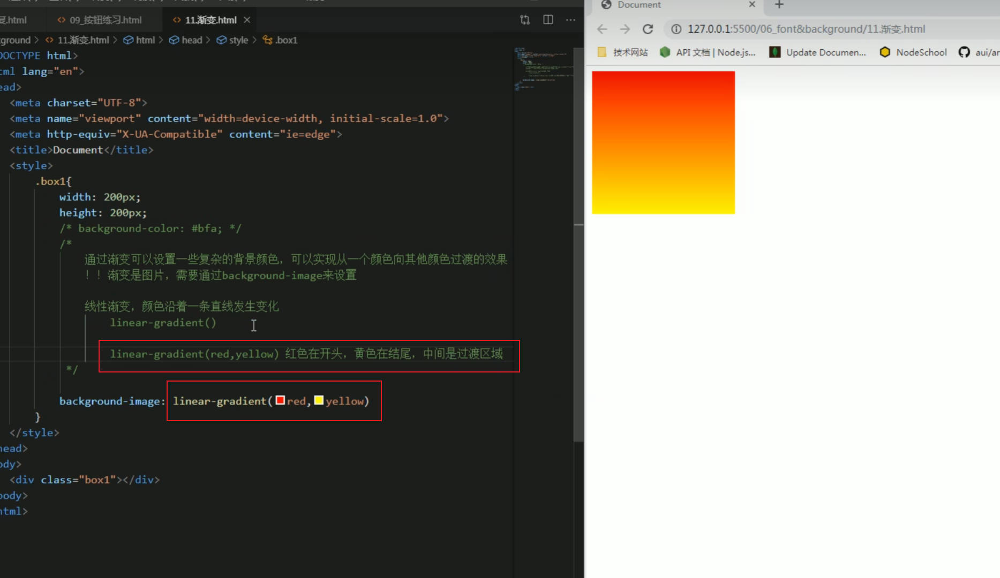
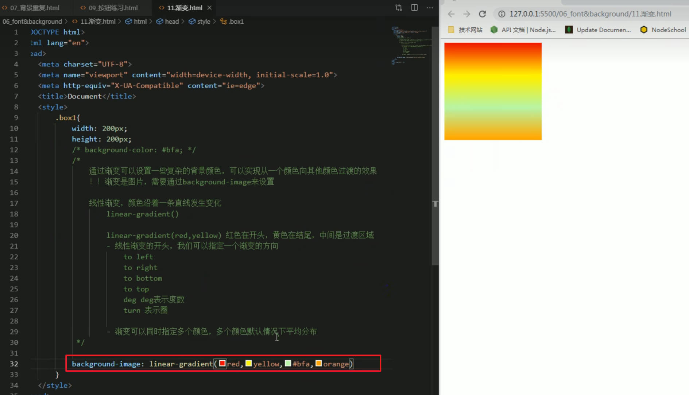
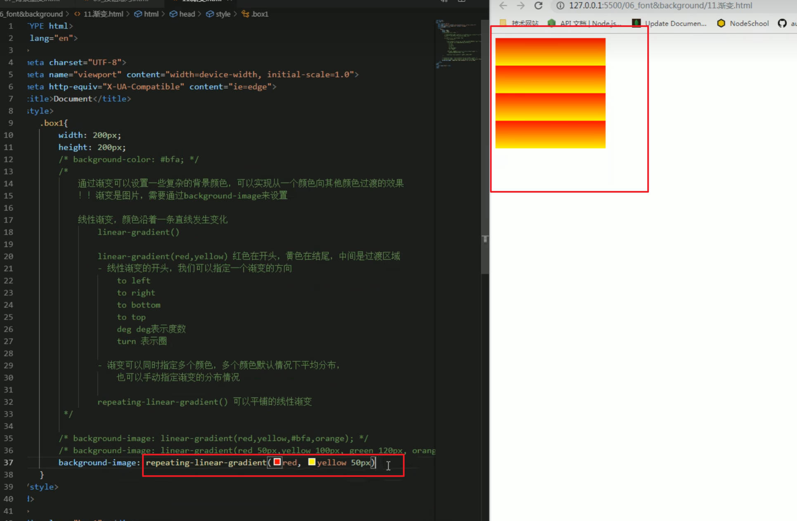
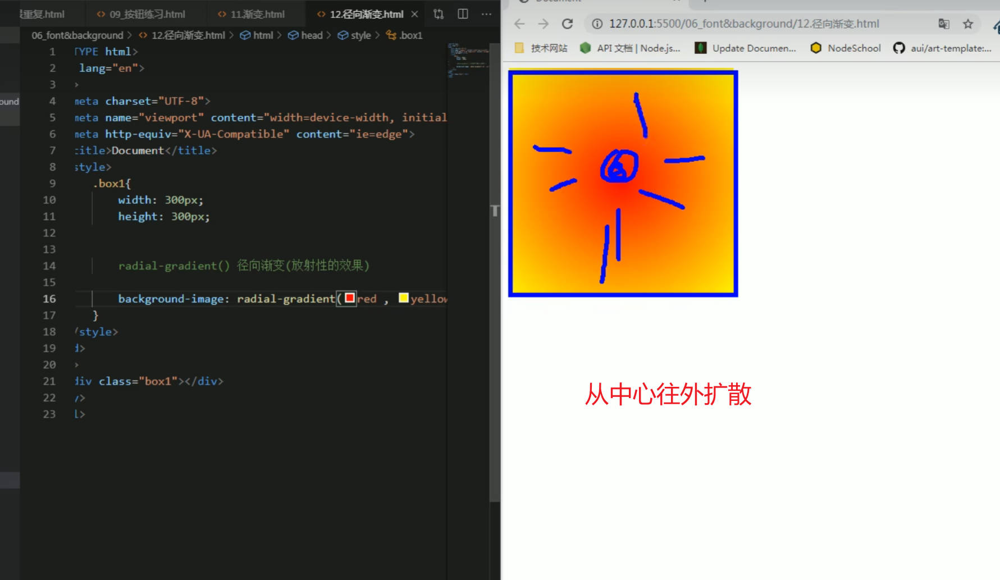
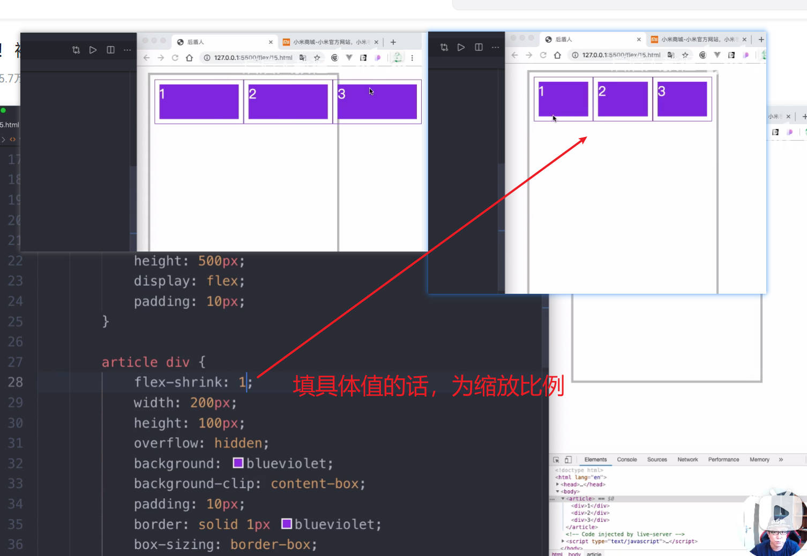

# CSS3 属性

## 线性渐变 linear-gradient

颜色沿着一条直线发生变化

linear-gradient(toright,red,yellow);

**toright 表示从左向右变色**

第一个参数可填值：

- to left
- to right
- to top
- to bottom
- xxxdeg 表示旋转的度数

渐变可以指定多个颜色，多个颜色默认情况下平均分配,可以手动指定渐变的分布情况

指定分布的情况：

- linear-gradient(red 50px,yellow);
  表示从 50px 的位置开始渐变

重复线性渐变
repeating-linear-gradient()

## radial-gradient() 径向渐变

tips:
默认情况下径向渐变的形状根据元素的形状来计算的
正方形 ——> 圆形
长方形 ——> 椭圆形
也可以手动指定径向渐变的大小

# flex 布局

## flex-shrink

填 1，设置缩放比例为 1
填 0 ，表示盒子保持原样，谁也不缩小（图左）
flex-shrink 计算规则：

- 必须子元素溢出
  例：父元素 500px，三个子元素分别问 150px、200px、300px
  三个子元素的 flex-shrink 分别为 1,2,3

1. 先计算出子元素溢出多少：150+200+300-500 = -150px
2. 计算总权重：1\*150+2\*200+3\*300 = 1450px
3. 计算子元素收缩多少：（第一个子元素）1\*150\*(150/1450) = 15.5px，则第一个子元素最终尺寸为 150-15.5 = 134.5

## flex-grow

放大
放大计算规则：

- 需要有剩余空间
  比如父元素宽 500px,三个子元素的宽度分别为 100、150、100px
  于是剩余空间为 150px
  设置第一个子元素 flex-grow:1、第二个为 2、第三个为 3
  则总和为 6

**则第一个子元素所分得的宽度最终为 1/6x150=25px，100+25px=125px 则为第一个盒子的最终宽度**

# 媒体查询响应式布局
