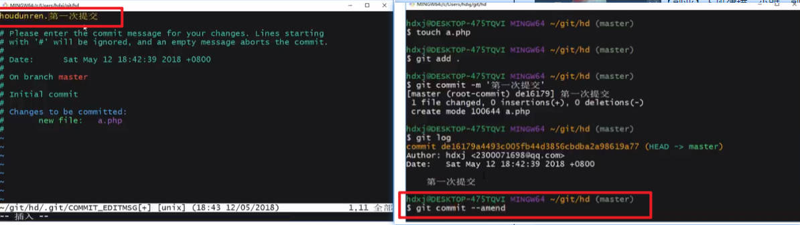
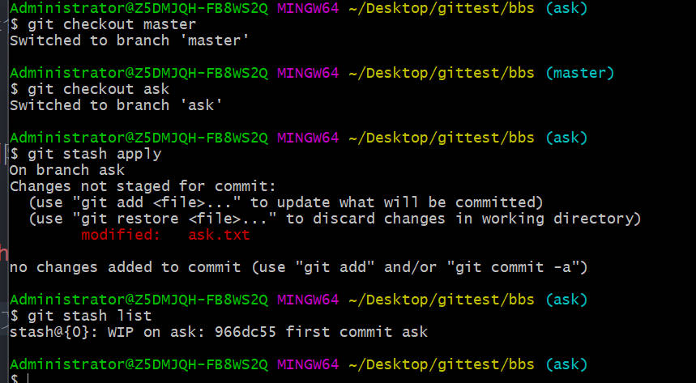
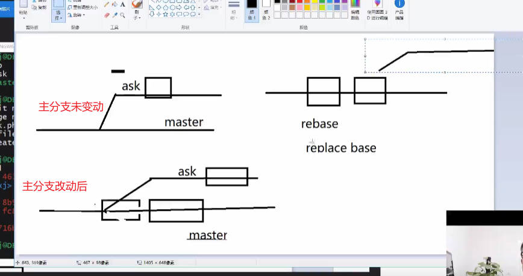

# GIT

## 集中式和分布式的区别

集中式只有一个版本库在远程服务器端，如果服务器端出现问题，则本地无法回退代码
分布式每台本地电脑都有一个版本库，可以任意回退代码

## 配置作者信息

git config --global user.email "xxxx@email.com"
git config --global user.name "xxx"

查询用户信息配置
git config -l

## 建立新仓库与维护旧仓库

1. 建立新仓库
   建立一个本地版本库
   git init

2. 维护旧仓库
   注意点：git clone 版本库的时候，一定要在没有使用过 git init 的文件夹中克隆

ls -a 可以查看当前目录下所有文件

## 使用命令完成 git 流水线操作

1. git add
2. git commit

## git 忽略文件配置

可以忽略不需要上传的文件

- 如何忽略文件
  创建一个.gitignore 文件，里面填不需要上传的文件名或文件后缀名
  如 \*.txt/ a.txt

- 如果有 a,b,c 三个 txt，只想提交 a.txt 则可以用如下代码
  \*.txt
  !a.txt

- 忽略文件夹
  /file

- 忽略文件夹子目录的所有文件
  /file/\*\*/\*.文件格式

适用场景：比如一个 demo 文件内有 a.php,还有个文件夹 conposer，里面有一个 1.php，这时使用/file/\*.php 则不会忽略 conposer 文件夹里面的 php 文件

## 从版本库中删除资源的技巧

- git rm [file]
  本地和仓库同时消失

- git rm --cached [file]
  本地不删除，只删除版本库的指定文件

## 修改文件名称

- git mv [file]
  改完再 add, commit

## 使用 log 日志查看历史操作行为

- git log
- git log -p
  查看提交的文件的变动信息
  -- git log --online
  简洁显示文件变动信息，展示提交的哈希值

- git log --name-only
  查看文件的变动信息

- git log --name-status
  文件变动状态的信息

## 使用 amend 修改最新一次提交事件

git commit --amend

## 管理暂存区中的文件

- 如果 git add 到暂存区后，想撤回操作可以使用命令

> git rm --cached [file]

- 如果文件不是第一次提交，想要撤回则使用，保留文件内容

> git reset HEAD [file]

- 让文件回到上一次提交版本的状态（撤销本次添加的内容） //git rm --cached 适用于第一次提交到暂存区，git checkout 适用以后多次提交后的情况

> git checkout -- [file]

## alias 命名别名提高操作效率

- 为 add 添加别名

> git config --global alias.a add

- 为 commit 添加别名

> git config --global alias.c commit

## Git 分支

并行开发，合并主分支，低耦合

- 创建分支

> git branch [branchName]

- 切换分支

> git checkout [branch]

**在分支内开发新增文件，并不会影响到 master 主分支**

- 简写

> git checkout -b "branchName"

**创建分支时，需要在 master 主分支进行操作**

## 规范的分支操作流程之分支的合并与删除

合并分支流程：

1. 切换到 master 主分支
2. 合并需要合并的分支
   > git merge [branchName]

- 删除分支
  > git branch -d branchName

## 分支冲突

## 分支管理 merged 及分支强制删除

- 查看合并了的分支

  > git branch --merged

- 查看未合并的分支

  > git branch --no-merged

- 强制删除分支
  > git branch -D [file]

## stash 临时储存区

当前分支文件进行了改动，并未提交，且想要切换分支时可暂入缓存区(什么时候可以使用暂存区？当文件 add 过一次或 commit 一次后才可以纳入暂存区)

- 临时存储命令

  > git stash

- 恢复暂存区内容
  当从其他分支切回之前使用暂存命令的分支时，可用如下命令恢复暂存区

  > git stash apply
  > 

- 恢复并删除暂存区

  > git stash pop

- 查看缓存区列表
  > git stash list

## Tag 标签

标签是对某个阶段的总结，是相对稳定的，不能乱打

- 显示标签列表

  > git tag

- 打标签
  > git tag [v.name]

## 生成 zip

> git archive [branch] --prefix='[filename/]' --forma-zip > [name.zip]

## rebase

rebase(replace base)用于优化分支合并

适用情况：主分支没有变动过，合并子分支时可直接合并。当分出去子分支后，主分支又发生了变动，会产生合并记录！此时可以使用 rebase 改变子分支的基础点

- 在子分支使用 rebase,将基础点指向 master 分支的最新点

> git rebase master

## 远程仓库

### 关联远程仓库

> git remote add origin [远程分支地址]

### 查看远程仓库

> git remote -v

### 推送数据到远程仓库

git push -u origin master

### 本地分支与 github 远程分支同步

- 查看远程分支

  > git branch -a

- 本地分支推送至远程分支(远程分支未创建)

  > git push --set-upstream origin [branchname]

### 请求远程分支

课程位置：p31 节

> git pull origin [branchName]:branchName

这段代码的作用是将远程分支的代码拉到本地，并在本地新建此分支
