# 预处理器

## 定义变量

- 定义变量用@开头，如定义一个颜色的变量 @color: #00acac;
  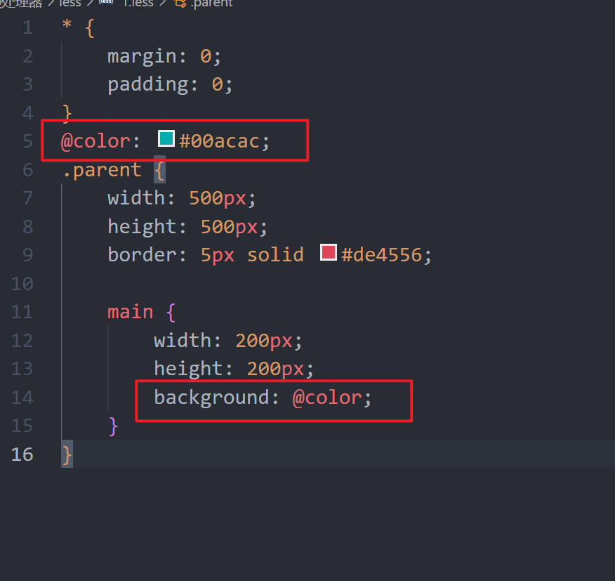

- 也可以将选择器名定义为变量，用法如下
  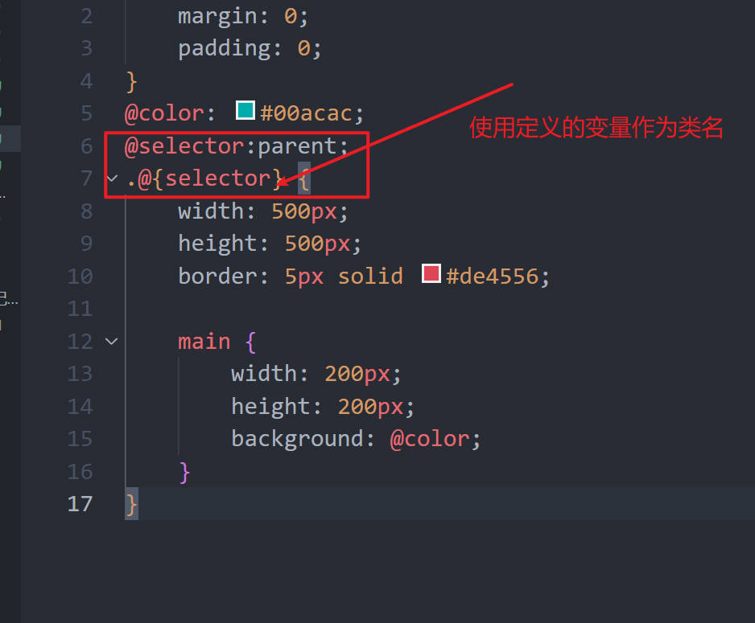

## less 的嵌套规则

- &的使用
  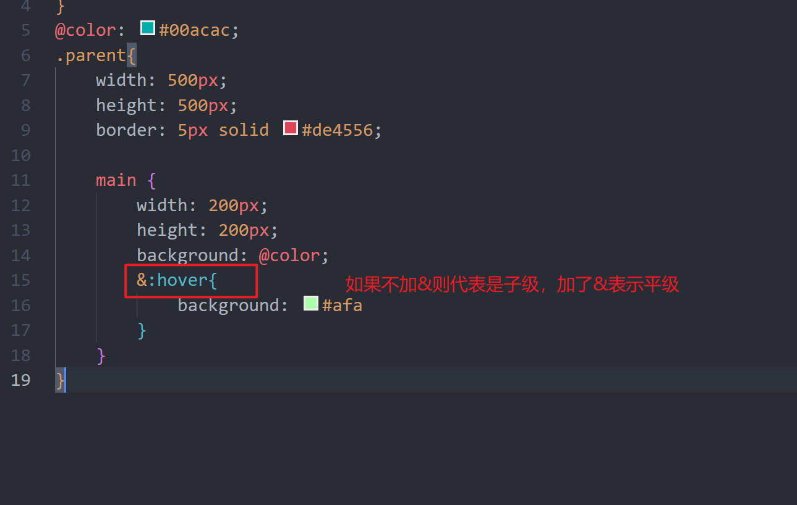

## less 的混合

混合就是将一系列属性从一个规则集引入到另一个规则集的方式

1. 普通混合
   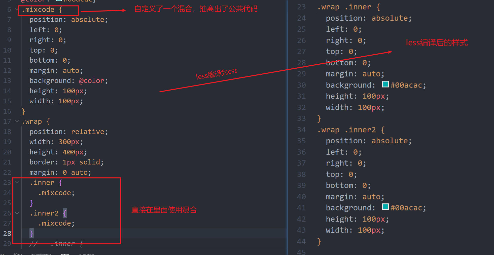
2. 不带输出的混合
   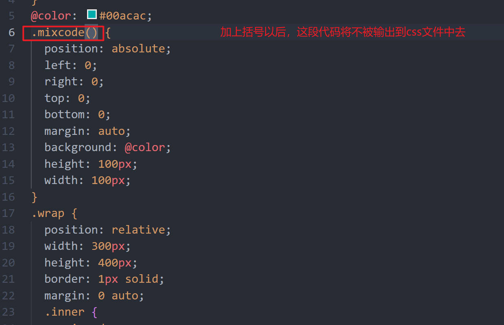
3. 带参数的混合
   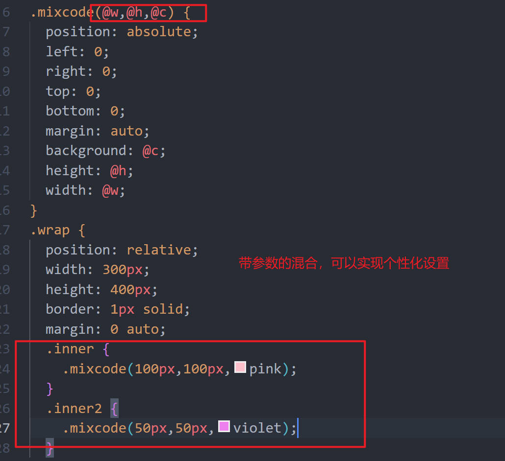
   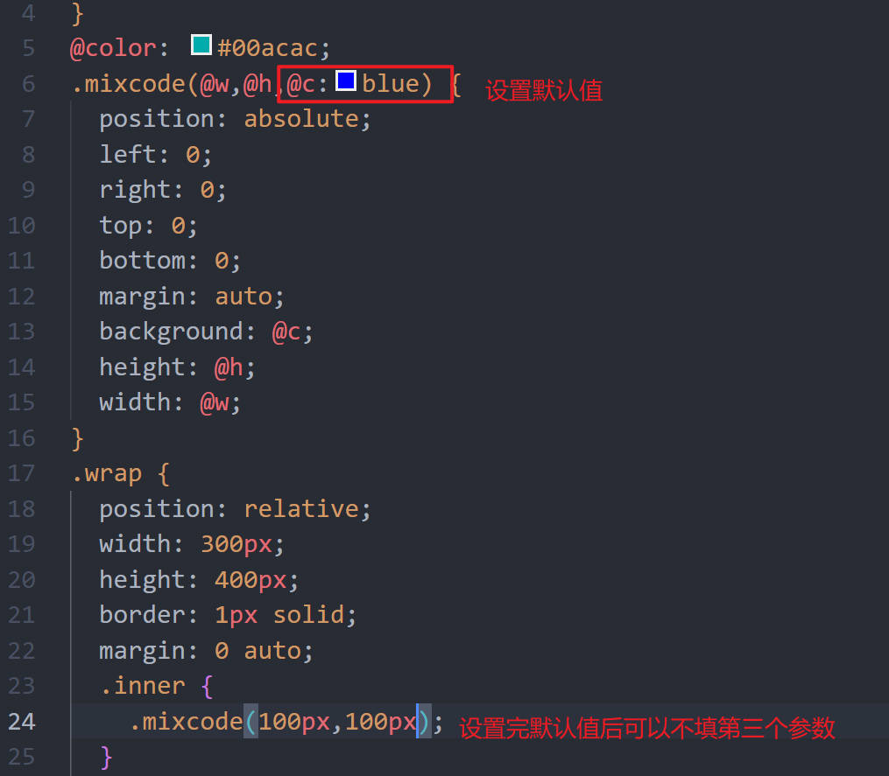
4. 带参数并且有默认值的混合
   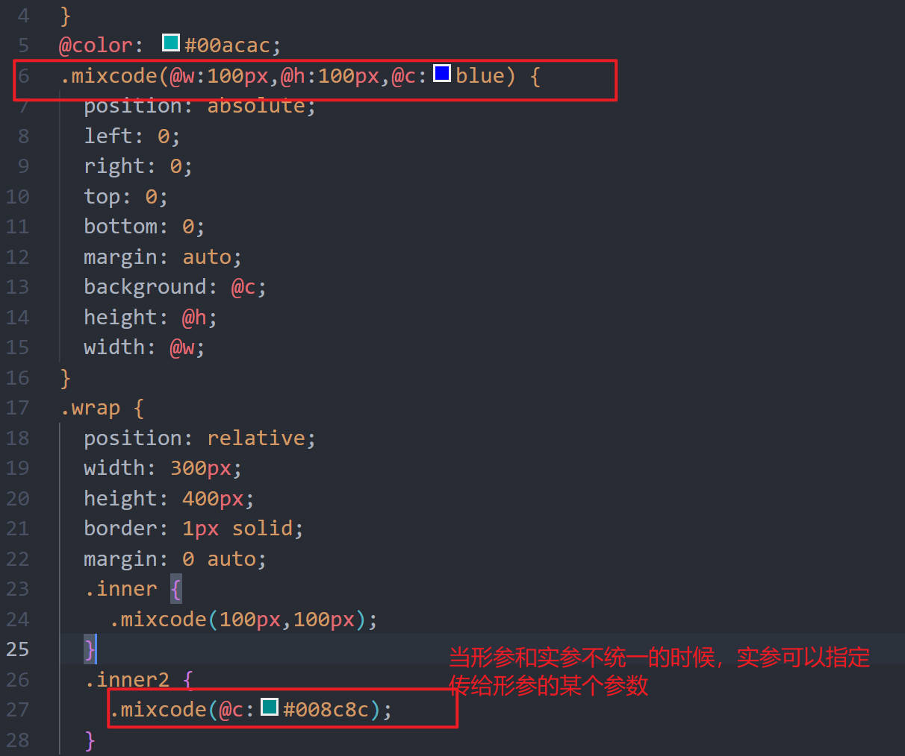
5. 带多个参数的混合
6. 命名参数
7. 匹配规则
   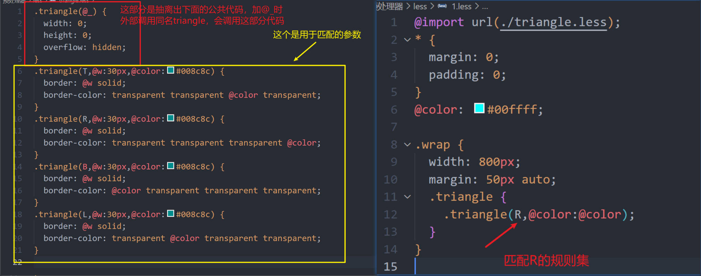
8. arguments 变量
   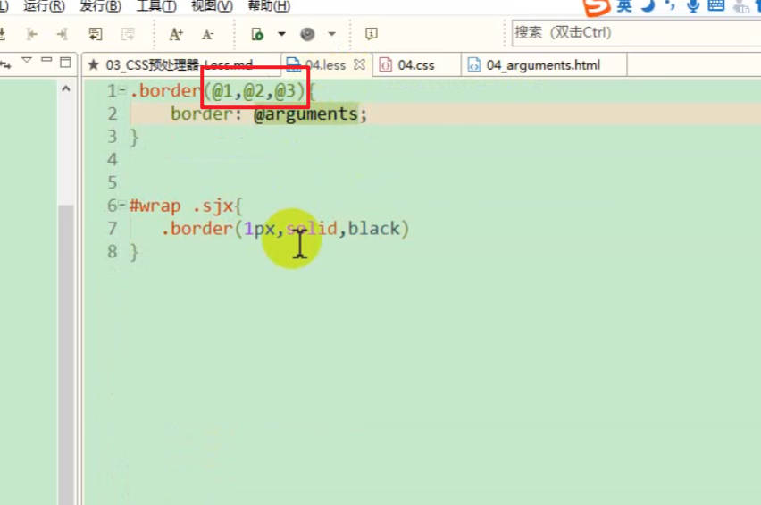

## less 运算

一方有单位即可 如（100+100px）

## less 继承

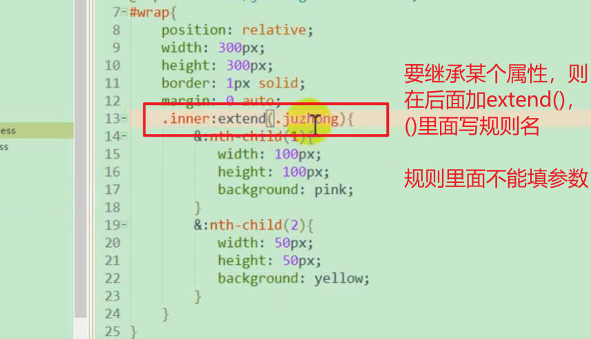

## 避免编译

使用~""
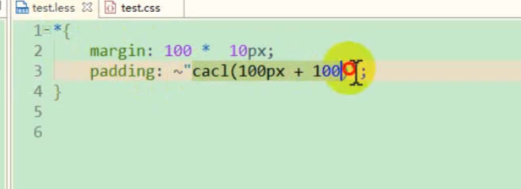
