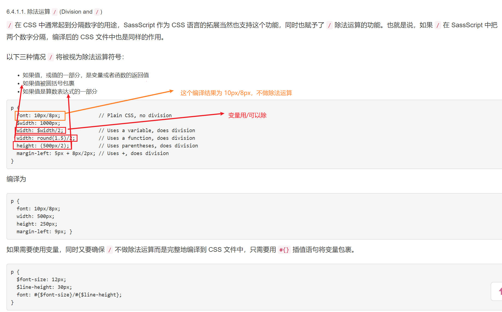
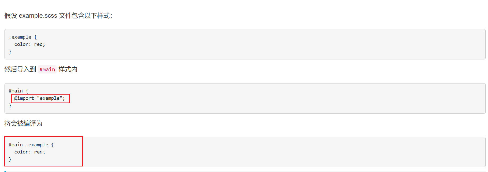
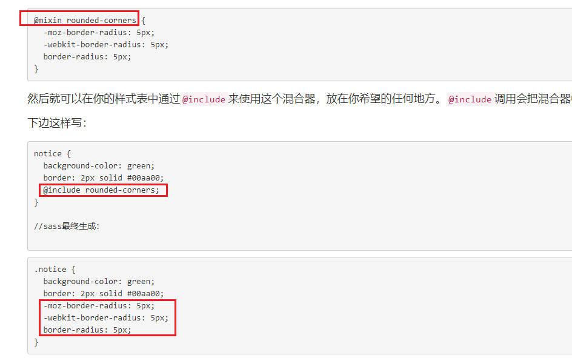

## sass 的集中输出格式

1. 嵌套
   :nested
2. 展开格式
   :expanded
3. 紧凑格式
   :compact
4. 压缩格式
   :compressed

## 父选择器&

## 属性嵌套

比如 font-family，font-size，font-weight 都以 font 作为属性的命名空间

## sass 注释

1. /\* \*/

2. //

## sass 变量

\$用来定义 sass 变量

## 数据类型

Sass 支持 6 种数据类型：

### 字符串

## 运算

### 除法运算符

- 如果需要同时使用变量，又确保/不做除法的话可以使用#{}将变量包裹

### 字符串+号

1. 如果不是数字，则文本可以拼接
2. 左侧有引号，右侧无引号，加号相连接之后编译结果有引号
3. 左侧无引号，右侧有引号，加号相连接之后编译结果无引号
   

## 差值语句

通过 #{} 插值语句可以在选择器或属性名中使用变量

## 变量定义 !default

## @import 指令

如果不想导入任何的 sass 文件，可以使用如下四种方式

## 关于导入 sass，不希望其编译为 css 的用法

- @import 命令还可以用在样式嵌套中，但需要注意的是**不能在混合指令 mixin 或控制指令中嵌套@import**
  

## 混合器

混合器，减少重复代码

- 不传参使用
  用@minxin 定义，用@inclue 使用
  

- 传参使用

## 继承

